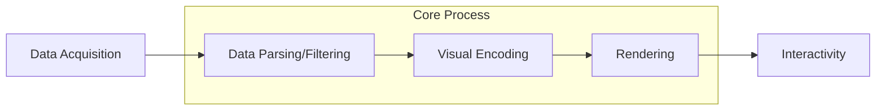
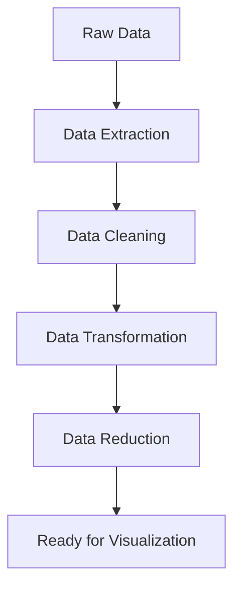
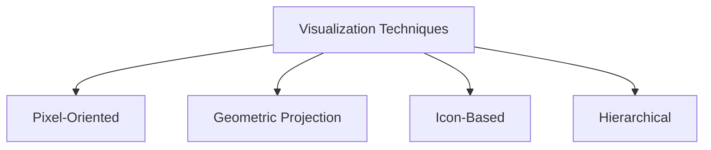
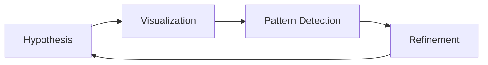
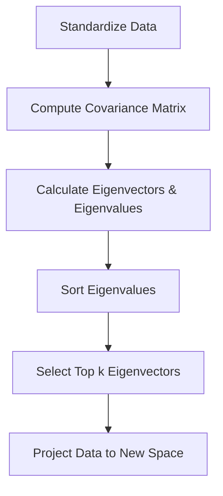

# Data Visualization Notes

## Table of Contents
1.  [Unit I: Introduction to Data Visualization](#unit-i-introduction-to-data-visualization)
2.  [Unit II: Data Visualization Techniques](#unit-ii-data-visualization-techniques)
3.  [Unit III: Data Visualization Tools](#unit-iii-data-visualization-tools)
4.  [Unit IV: Visualizing Multidimensional Data](#unit-iv-visualizing-multidimensional-data)
5.  [Unit V: Advancements in Data Visualization](#unit-v-advancements-in-data-visualization)

---

## Unit I: Introduction to Data Visualization

### 1. Overview of Data Visualization

**A. Definition**
Data Visualization is the graphical representation of information and data. By using visual elements like charts, graphs, and maps, data visualization tools provide an accessible way to see and understand trends, outliers, and patterns in data.

**B. Significance in AI and Data Science**
In the context of AI and Data Science, visualization is not just about making pretty charts; it is a critical step in the data pipeline.

*   **Exploratory Data Analysis (EDA):** Before building AI models, scientists visualize data to understand distributions, correlations, and anomalies.
*   **Model Evaluation:** Visualizing error rates, confusion matrices (e.g., ROC curves), and decision boundaries helps in understanding how well a model performs.
*   **Communication:** AI models are often "black boxes." Visualization helps explain the results (Explainable AI) to non-technical stakeholders (CEOs, managers).
*   **Pattern Recognition:** The human brain processes visual information 60,000 times faster than text. Visualization helps identify patterns that algorithms might miss or that need feature engineering.

**C. Principles of Data Visualization**
To create effective visualizations, certain core principles must be followed (often attributed to Edward Tufte):

*   **Clarity:** The visual must be easy to read and interpret without ambiguity.
*   **Accuracy:** Represent the data truthfully. Avoid distorted axes (e.g., not starting at zero) that exaggerate differences.
*   **Efficiency:** Convey the maximum amount of information with the least amount of "ink" (Data-Ink Ratio). Remove "chart junk" (unnecessary 3D effects, shadows).
*   **Context:** Always provide labels, legends, and titles so the user knows what they are looking at.

---

### 2. Methodology of Data Visualization

The methodology describes the pipeline or process involved in converting raw data into a visual representation.



*   **Data Acquisition:** Gathering data from various sources (SQL, APIs, CSVs).
*   **Data Parsing/Filtering:** Selecting only the relevant data needed for the specific visual.
*   **Visual Encoding:** Mapping data attributes to visual attributes.
    *   *Example:* Mapping "Temperature" to "Color" and "Time" to the "X-axis."
*   **Rendering:** Generating the image on the screen.
*   **Interactivity:** Adding features like zooming, hovering, and filtering to allow users to explore the data.

---

### 3. Applications of Data Visualization

*   **Business Intelligence:** Dashboards (PowerBI, Tableau) to track KPIs, sales revenue, and customer churn.
*   **Healthcare:** Visualizing patient vitals, spread of epidemics (e.g., COVID-19 heatmaps), and medical imaging.
*   **Finance:** Stock market trends, candlestick charts, and risk analysis.
*   **Geospatial Analysis:** Weather forecasting, traffic flow analysis, and supply chain logistics.
*   **Scientific Research:** Visualizing complex molecules, genomic sequences, or astronomical data.

---

### 4. Data Pre-processing for Visualization
*Note: This section is highly important as per the exam paper (Q1 a, Q1 b, Q8 i).*

Raw data is rarely ready for visualization. It is often messy, incomplete, or too voluminous. Pre-processing is the step of converting raw data into a clean dataset.



**A. Data Extraction**
The process of retrieving data from various sources for further processing.
*   **Sources:** Databases (SQL), Cloud storage, Web APIs, Flat files (CSV, Excel).
*   **Goal:** To centralize the data into a working environment (like Python Pandas or R).

**B. Data Cleaning**
Handling errors and inconsistencies in the data.
*   **Missing Values:** Data is often missing. Techniques to handle this:
    *   *Deletion:* Remove rows with missing data (bad if data is scarce).
    *   *Imputation (Statistical):* Fill with Mean, Median, or Mode.
    *   *Imputation (Algorithmic - Exam Topic Q1b):* Using **K-Nearest Neighbors (KNN)**. You find the 'k' most similar data points to the missing one and use their average to fill the gap. This is useful for heterogeneous data where simple averages might be inaccurate.
*   **Noise/Outliers:** Removing data points that are clearly errors (e.g., Age = 200).
*   **Duplicate Data:** Identifying and removing repeated entries.

**C. Data Transformation**
Converting data into a format suitable for visualization.
*   **Normalization/Scaling:** Scaling data to a specific range (e.g., 0 to 1). This is crucial when comparing variables with different units (e.g., Salary in thousands vs. Age in years).
*   **Discretization:** Converting continuous data into intervals (e.g., grouping ages into buckets: 0-18, 19-35, 36+).
*   **Attribute Construction:** Creating new features from existing ones (e.g., creating a "Profit" column by subtracting "Cost" from "Revenue").

**D. Data Aggregation (Exam Topic Q1 a)**
Aggregation involves combining multiple data points into a single summary value. This is essential when the data is too large to plot individually.
*   **Definition:** The process of gathering data and expressing it in a summary form.
*   **Common Functions:** Sum, Average (Mean), Count, Min, Max.
*   **Example:**
    *   *Raw Data:* You have a record of every single cup of coffee sold in a shop for a year (100,000 rows).
    *   *Visualization Goal:* A bar chart showing monthly sales.
    *   *Aggregation:* You group the data by "Month" and sum the "Sales Amount." The result is 12 data points (one for each month) instead of 100,000.

**E. Data Integration (Exam Topic Q1 a)**
Combining data from multiple disparate sources into a unified view.
*   **Definition:** Merging data from different databases or files which may have different structures or identifiers.
*   **Challenges:**
    *   *Schema Conflicts:* One database uses "CustomerID" (Integer), another uses "Cust_ID" (String).
    *   *Data Redundancy:* The same information stored in different places.
*   **Example:**
    *   *Source A:* Marketing Database (Contains Email, Campaign Name).
    *   *Source B:* Sales Database (Contains Email, Item Bought, Price).
    *   *Integration:* You join Source A and Source B using "Email" as the key to visualize "Which Marketing Campaign led to the highest Sales?"

**F. Data Reduction**
Techniques to obtain a reduced representation of the data set that is much smaller in volume but produces the same (or almost the same) analytical results.
*   **Dimensionality Reduction:** Reducing the number of columns (variables).
    *   *Technique:* Principal Component Analysis (PCA). Removing irrelevant attributes.
*   **Numerosity Reduction:** Reducing the number of rows.
    *   *Technique:* Sampling (taking a random 10% of the data to visualize the trend without processing the full dataset).

---

### Important Questions & Answers (Unit I)

**Q1: Define Data Visualization. Discuss its significance in the field of AI and Data Science with the help of examples.**
*Answer:*
Data Visualization is the graphical representation of information and data. By using visual elements like charts, graphs, and maps, visualization tools provide an accessible way to see and understand trends, outliers, and patterns in data. It translates complex numerical data into a visual context, making it easier for the human brain to process.

**Significance in AI and Data Science:**
1.  **Exploratory Data Analysis (EDA):** Before building any AI model, data scientists must understand the data structure. Visualization helps identify distributions (e.g., histograms), correlations (e.g., heatmaps), and outliers that could skew the model.
2.  **Model Performance Evaluation:** In AI, visualization is crucial for interpreting results. For example, Confusion Matrices visually depict how well a classification model is performing, while ROC Curves help determine the trade-off between sensitivity and specificity.
3.  **Pattern Recognition:** AI thrives on patterns. Visualizations allow humans to detect patterns that algorithms might initially miss, aiding in feature selection.
4.  **Communication:** AI models are often "black boxes." Visualization helps explain complex model predictions to non-technical stakeholders (e.g., business executives) effectively, bridging the gap between technical results and business decisions.

**Q2: Explain the concepts of Data Aggregation and Data Integration in visualization with the help of examples. (Previous Year Exam Question)**
*Answer:*
1.  **Data Aggregation:**
    Aggregation is the process of combining multiple data points into a single summary value. In visualization, this is essential when datasets are too large to plot individually, which would otherwise result in visual clutter ("overplotting"). Common aggregation functions include Sum, Average, Count, Min, and Max.
    *   *Example:* Imagine a retail store with a dataset containing 100,000 rows representing every single transaction made in a year. Plotting 100,000 points on a line chart is messy. Instead, you aggregate the data by summing the "Sales Amount" by "Month." The result is a clean line chart with just 12 data points (Jan–Dec), clearly showing the monthly sales trend.
2.  **Data Integration:**
    Data Integration involves merging data from disparate sources (different databases, files, or formats) into a unified view. This is critical because meaningful insights often require connecting different aspects of a business.
    *   *Example:* A company has customer personal details in an SQL Database (Source A) and customer web browsing history in a NoSQL Log File (Source B). To visualize "Which age group visits the website most frequently?", you must integrate these two sources using a common key (like Customer ID) to create a single dataset that links Age (from Source A) to Visit Count (from Source B).

**Q3: What is Data Cleaning? Explain how you will find missing values in heterogeneous data using K-Nearest Neighbors (KNN). (Previous Year Exam Question)**
*Answer:*
Data Cleaning is the pre-processing step of detecting and correcting (or removing) corrupt, inaccurate, or missing records from a dataset. It ensures that the visualization is accurate and not misleading. Common cleaning tasks include removing duplicates, fixing structural errors (typos), and handling outliers.

**Handling Missing Values using K-Nearest Neighbors (KNN):**
While simple methods like filling missing values with the generic "Mean" or "Median" work for simple data, they can be inaccurate for heterogeneous (diverse) data. KNN is a more advanced, algorithm-based imputation method.
1.  **The Process:** To fill a missing value in a specific row, the KNN algorithm looks at the entire dataset to find the 'K' number of rows (neighbors) that are most similar to the row with the missing data. Similarity is usually calculated using distance metrics (like Euclidean distance).
2.  **Imputation:** Once the nearest neighbors are identified, the algorithm calculates the weighted average (for numerical data) or the mode (for categorical data) of those neighbors and fills the missing value.
3.  **Benefit:** This method is superior because it considers the context of the data. For example, if a "Salary" value is missing, KNN estimates it based on people with similar "Experience" and "Education," rather than just the average salary of everyone.

**Q4: Describe the Methodology of Data Visualization. What are the key steps involved in converting raw data into a visual representation?**
*Answer:*
The Methodology of Data Visualization refers to the systematic pipeline used to transform raw, abstract data into a meaningful visual interface. This process ensures the final output is both accurate and user-friendly. The key steps include:
1.  **Acquisition:** Gathering data from various sources such as databases, web scraping, or APIs.
2.  **Parsing:** Classifying the data into a structured format and organizing it into categories.
3.  **Filtering:** Selecting only the specific data required for the visual. This involves removing unnecessary noise to focus on the story the data tells.
4.  **Mining:** Applying mathematical statistics or data mining methods to discern patterns (e.g., clustering or sorting) within the filtered data.
5.  **Representing:** The core design step. This involves choosing the basic visual form, such as a bar chart, scatter plot, or tree map, and mapping data attributes to visual attributes (e.g., mapping "Profit" to "Bar Height").
6.  **Refining:** Improving the visual presentation by adjusting colors, axes, labels, and removing "chart junk" to enhance clarity.
7.  **Interacting:** Adding methods for the user to manipulate the data, such as zooming, hovering for tooltips, or filtering dynamically.

**Q5: Write a short note on Data Reduction techniques in the context of Data Visualization.**
*Answer:*
Data Reduction is the process of obtaining a reduced representation of the dataset that is much smaller in volume but still produces the same (or almost the same) analytical results. In visualization, this is vital because rendering millions of data points is computationally expensive and visually overwhelming.
There are two main strategies for Data Reduction:
1.  **Dimensionality Reduction:** This involves reducing the number of attributes (columns) in the dataset.
    *   *Technique:* Principal Component Analysis (PCA) transforms large sets of variables into a smaller one that still contains most of the information. This helps in visualizing high-dimensional data in 2D or 3D space.
    *   *Benefit:* It removes redundant or irrelevant variables that clutter the visualization.
2.  **Numerosity Reduction:** This involves reducing the number of data volume (rows).
    *   *Technique:* Sampling allows visualizers to pick a representative subset (e.g., random 10%) of the data. Binning/Histograms group continuous data into small intervals (bins) replacing individual values with counts.
    *   *Benefit:* It speeds up rendering time and prevents "overplotting," where data points overlap so much that they become indistinguishable blobs.

**Q6: Explain the core Principles of Data Visualization. Why is "Data-Ink Ratio" important?**
*Answer:*
To create effective and truthful visualizations, designers must follow specific core principles, often popularized by Edward Tufte:
1.  **Clarity and Simplicity:** The primary goal is to communicate information clearly. The visualization should be intuitive, with clear labels, legends, and titles.
2.  **Accuracy/Integrity:** The visual must not distort the data. For example, bar charts should usually start the Y-axis at zero to prevent exaggerating small differences between values.
3.  **Context:** Data is meaningless without context. Visualizations must answer "Compared to what?" by providing historical data or benchmarks.

**The Data-Ink Ratio:**
This is a critical principle which states that a designer should maximize the share of ink on the graphic that represents data-information.
*   **Concept:** $ \text{Data-Ink Ratio} = \frac{\text{Data-Ink}}{\text{Total Ink used in Graphic}} $
*   **Importance:** A high data-ink ratio means the chart is free of "chart junk"—unnecessary 3D effects, dark grid lines, or decorative backgrounds. By removing these distractions, the viewer focuses entirely on the trends and patterns in the actual data, making the visualization more efficient and professional.

---

## Unit II: Data Visualization Techniques

This unit focuses on specific methodologies used to visualize different types of data (Multivariate, Hierarchical, Scalar, and Vector) and the techniques used for Exploratory Data Analysis (EDA).

### 1. Classification of Visualization Techniques

Daniel A. Keim classified information visualization techniques into four main categories based on how they handle large, high-dimensional data.



**A. Pixel-Oriented Visualization Techniques**
*(Important: Asked in Q2(b) of Prev. Year Paper)*
*   **Definition:** Pixel-oriented techniques map each data value to a single colored pixel. This allows for the visualization of the largest amount of data possible on a screen. If a screen has 1 million pixels, you can visualize 1 million data values simultaneously.
*   **Mechanism:**
    *   *Color Mapping:* A value is normalized (e.g., 0 to 1) and mapped to a color scale (e.g., yellow for low values, red for high values).
    *   *Arrangement:* The pixels are arranged in the display window according to specific patterns.
    *   *Query-Independent:* Uses space-filling curves (like the Z-Curve or Hilbert Curve) to cluster similar data points together to reveal patterns.
    *   *Query-Dependent:* Data is arranged based on its similarity to a specific query.
*   **Benefits:**
    *   Maximum utilization of screen space.
    *   Ability to visualize massive datasets without aggregation or loss of detail.
    *   Effective for spotting local patterns or clusters in large databases.

**B. Geometric Projection Visualization Techniques**
*   **Definition:** These techniques aim to find "interesting" projections of multi-dimensional datasets onto a 2D or 3D display. They map data attributes to geometric coordinates.
*   **Common Techniques:**
    *   *Scatter Plots:* Standard X-Y plotting. Good for 2 dimensions.
    *   *Scatter Plot Matrix:* A grid of scatter plots comparing every pair of variables.
    *   *Parallel Coordinates:* Instead of orthogonal axes (X and Y at 90 degrees), axes are placed parallel to each other vertically. A data point is represented as a line connecting the values on each axis. Excellent for detecting correlations in high-dimensional data (e.g., 10+ variables).

**C. Icon-Based Visualization Techniques**
*   **Definition:** These techniques map data attributes to the features of an icon (or glyph). The human perception system is very good at distinguishing small changes in shape or facial expressions.
*   **Common Techniques:**
    *   *Chernoff Faces:* Data attributes are mapped to facial features (eye size, mouth curvature, nose length). Example: Identifying customer satisfaction (Mouth curve = happiness score). Limitation: Hard to compare more than 10-15 faces at once.
    *   *Star Plots (Radar Charts):* Axes radiate from a center point. Data values are plotted on these axes and connected to form a star/polygon shape. Use: Comparing performance metrics (e.g., Comparing two athletes across Speed, Strength, Agility, and Stamina).

**D. Hierarchical Visualization Techniques**
*(Important: Asked in Q8(ii) of Prev. Year Paper)*
*   **Definition:** Used for data that has a parent-child or tree-like structure (e.g., file systems, organizational charts, taxonomies).
*   **Common Techniques:**
    *   *Node-Link Diagrams:* Standard tree charts. Good for structure, but space-inefficient for large trees.
    *   *TreeMap:* Uses nested rectangles to display the hierarchy. The size of the rectangle represents a quantitative value (e.g., File Size), and the color represents another (e.g., File Type). Benefit: 100% space utilization.
    *   *Sunburst Chart:* A circular tree map. The inner circle is the root, and outer rings represent deeper levels of the hierarchy.

---

### 2. Visualizing Complex Data and Relations
*(Important: Asked in Q2(a) of Prev. Year Paper)*

Complex data refers to data that isn't just rows and columns but involves relationships, networks, or unstructured formats.

*   **Graph/Network Visualization:** Used when the relationship (link) is as important as the data point (node).
*   **Force-Directed Layouts:** Nodes repel each other like magnets, while links act like springs. This naturally organizes the graph so that connected nodes are close together.
*   **Matrix Views:** An adjacency matrix where rows and columns represent nodes, and a colored cell indicates a connection. Benefit: No "edge crossing" (messy lines) which is common in node-link diagrams.

---

### 3. Visualizing Scalar and Point Techniques

**Scalar Data:** Data that has magnitude but no direction (e.g., Temperature, Pressure, Density).

*   **Color Maps:** The primary way to visualize scalar fields. A function maps a scalar value to a color.
    *   *Sequential:* (Light Blue to Dark Blue) for ordered data (0 to 100).
    *   *Diverging:* (Red to White to Blue) for data with a midpoint (e.g., temperature deviation from average).
*   **Contouring (Height Plots):**
    *   *Isolines:* Lines connecting points of equal value (e.g., topographic maps showing elevation).
    *   *Isosurfaces:* The 3D equivalent of isolines (e.g., a 3D shell showing areas of constant radiation levels).

---

### 4. Vector Visualization Techniques

**Vector Data:** Data that has both Magnitude and Direction (e.g., Wind velocity, Fluid flow, Magnetic fields).

*   **Vector Properties:**
    *   *Direction:* Where the flow is going.
    *   *Magnitude:* How fast/strong the flow is.
*   **Techniques:**
    *   *Vector Glyphs (Hedgehogs):* Placing an arrow at every data point. Arrow Head points to direction. Arrow Length/Thickness represents magnitude. Drawback: Can get very cluttered (cluttering problem).
    *   *Vector Color Coding:* Mapping direction to Hue (Color wheel) and magnitude to Intensity (Brightness).
    *   *Stream Objects:* Instead of showing arrows at static points, these techniques trace the path a particle would take if placed in the flow.
        *   *Streamlines:* Lines tracing the flow path at a specific instance in time.
        *   *Stream Ribbons:* Flat ribbons that rotate to show vorticity (twisting of the flow).

---

### 5. Exploratory Data Analysis (EDA) Techniques
*(Important: Asked in Q3(a) of Prev. Year Paper)*

**Definition:** EDA is an approach to analyzing data sets to summarize their main characteristics, often using visual methods. It is the "detective work" done before formal modeling.

**Objectives of EDA:**
*   Spotting anomalies and outliers.
*   Testing underlying assumptions.
*   Discovering patterns and correlations.



**EDA Techniques Categories:**
*   **Univariate Analysis (One Variable):**
    *   *Histogram:* To check the distribution (Is it Normal/Gaussian? Is it skewed?).
    *   *Box Plot (Box and Whisker):* Crucial for detecting Outliers and understanding the spread (Interquartile Range).
*   **Bivariate Analysis (Two Variables):**
    *   *Scatter Plot:* To check the relationship between two continuous variables (e.g., Height vs. Weight).
    *   *Correlation Matrix (Heatmap):* A grid showing correlation coefficients (from -1 to +1) between variables.
*   **Multivariate Analysis (Many Variables):**
    *   *Pair Plot:* A matrix of scatter plots for every variable against every other variable.
    *   *Dimensionality Reduction (PCA):* Visualizing complex data in 2D to see clusters.
*   **Confusion Matrix:** (Asked in Q5b): While typically a metric, visually representing a confusion matrix as a heatmap helps quickly identify which classes a model is confusing (e.g., predicting "Dog" when it is actually a "Cat").

---

### Important Questions & Answers (Unit II)

**Q1: Explain Pixel-Oriented Visualization Techniques. Discuss its advantages and how it helps in visualizing large datasets. (Previous Year Exam Question)**
*Answer:*
Pixel-Oriented Visualization is a technique designed to visualize very large datasets by mapping each individual data value to a single colored pixel on the screen. Since a standard monitor can display millions of pixels, this technique allows for the representation of millions of data points simultaneously without the need for aggregation or sampling.
*   **How it Works:**
    *   *Color Mapping:* Data values are normalized (e.g., scaled between 0 and 1) and mapped to a color scale (e.g., yellow for low values, red for high values).
    *   *Arrangement:* The pixels are arranged in the display window according to specific patterns. For query-independent visualization, space-filling curves like the Z-Curve or Hilbert Curve are used to cluster related data points together, ensuring that similar data values appear close to each other on the screen.
*   **Advantages:**
    *   *High Density:* It provides the highest possible information density, allowing users to view entire databases at a glance.
    *   *Pattern Detection:* It is highly effective for detecting local clusters, outliers, and patterns that might be lost in aggregation techniques like bar charts.
    *   *No Information Loss:* Unlike histograms which summarize data, pixel-oriented techniques preserve the detail of every single data point.

**Q2: Discuss Exploratory Data Analysis (EDA) techniques with the help of suitable examples. (Previous Year Exam Question)**
*Answer:*
Exploratory Data Analysis (EDA) is an approach to analyzing datasets to summarize their main characteristics, often using visual methods. It is the preliminary step in data science used to understand the data's structure, detect outliers, and test hypotheses before formal modeling.
*   **Key EDA Techniques:**
    *   *Univariate Analysis (One Variable):* Focuses on the distribution of a single attribute.
        *   **Histogram:** visualizes the frequency distribution. For example, plotting the ages of all employees to see if the workforce is predominantly young or old.
        *   **Box Plot:** Essential for identifying outliers and understanding the spread (Interquartile Range) of the data.
    *   *Bivariate Analysis (Two Variables):* Analyzes the relationship between two attributes.
        *   **Scatter Plot:** Plots two continuous variables (e.g., "Advertising Spend" vs. "Sales Revenue") to check for correlations (linear or non-linear).
    *   *Multivariate Analysis (Many Variables):*
        *   **Heatmap/Correlation Matrix:** A color-coded grid showing correlation coefficients between all variable pairs. Dark colors might indicate strong positive correlation, while light colors indicate no correlation.
        *   **Pair Plots:** A grid of scatter plots allowing the analyst to see relationships between every pair of variables in the dataset simultaneously.

**Q3: Explain Hierarchical Visualization Techniques. Differentiate between Node-Link diagrams and TreeMaps.**
*Answer:*
Hierarchical Visualization Techniques are designed to represent data that has a parent-child or tree-like structure, such as file directories, organizational charts, or biological taxonomies. The goal is to show relationships between the "root," "branches," and "leaf" nodes.
1.  **Node-Link Diagrams:**
    These are the traditional tree charts (like a family tree). Nodes are represented as dots or boxes, and relationships are represented as lines (links).
    *   *Pros:* The structure and depth of the hierarchy are very easy to understand.
    *   *Cons:* They use screen space inefficiently. As the tree grows, the diagram becomes very wide or deep, leaving much of the screen empty (whitespace).
2.  **TreeMaps:**
    TreeMaps solve the space issue by using a "space-filling" approach. The hierarchy is displayed as a set of nested rectangles.
    *   *Mechanism:* The main rectangle represents the root. It is tiled with smaller rectangles representing children. The size of a rectangle corresponds to a quantitative variable (e.g., File Size), and the color corresponds to a categorical variable (e.g., File Type).
    *   *Pros:* 100% screen utilization; excellent for spotting large leaf nodes in deep hierarchies (e.g., finding the largest file on a hard drive).

**Q4: Describe Vector Visualization Techniques. How are Vector Glyphs and Streamlines used to visualize flow?**
*Answer:*
Vector Visualization deals with data that possesses both Magnitude (size/strength) and Direction. This is common in scientific domains like fluid dynamics (airflow over a car), meteorology (wind maps), and electromagnetic fields.
1.  **Vector Glyphs (Hedgehogs):**
    This technique places an icon (usually an arrow) at specific data points.
    *   *Direction:* The arrow points in the direction of the flow.
    *   *Magnitude:* The length or thickness of the arrow represents the speed or strength.
    *   *Limitation:* If data points are dense, arrows can overlap, causing "visual clutter," making the map unreadable.
2.  **Stream Objects (Streamlines):**
    To solve the clutter problem, Streamlines trace the path a massless particle would take if placed in the flow.
    *   *Mechanism:* Instead of static arrows, continuous lines are drawn that are tangent to the velocity vector at every point.
    *   *Usage:* They provide a cleaner, intuitive view of flow patterns, such as vortices or laminar flow. Advanced variations include Stream Ribbons (which twist to show rotation/vorticity) and Stream Tubes (which expand to show divergence).

**Q5: Compare Geometric Projection Techniques: Scatter Plot Matrix vs. Parallel Coordinates.**
*Answer:*
Both Scatter Plot Matrices and Parallel Coordinates are Geometric Projection Techniques used to visualize multivariate (high-dimensional) data, but they approach the problem differently.
1.  **Scatter Plot Matrix:**
    This is a grid of 2D scatter plots. If you have 5 variables, you create a $5 \times 5$ grid where every variable is plotted against every other variable.
    *   *Pros:* Intuitive and familiar to most users. Good for seeing pairwise correlations (e.g., A vs. B).
    *   *Cons:* It becomes unreadable with high dimensionality. A 20-variable dataset requires 400 small plots, making it hard to see details. It only shows relationships between two variables at a time.
2.  **Parallel Coordinates:**
    Instead of orthogonal axes (X and Y at 90°), axes are placed parallel to each other vertically. A single data point is represented as a polyline connecting the values across all axes.
    *   *Pros:* Can handle a much higher number of dimensions (e.g., 20+ variables) in a single view.
    *   *Cons:* Can suffer from "clutter" if thousands of lines overlap. However, it is superior for identifying patterns that span multiple variables simultaneously (e.g., "High A leads to Low B, which leads to High C").

**Q6: Explain the difference between Visualizing Scalar data and Vector data with examples.**
*Answer:*
The distinction lies in the properties of the data being represented.
1.  **Scalar Data Visualization:**
    *   *Definition:* Scalar data involves values that have only magnitude but no direction.
    *   *Examples:* Temperature, Pressure, Density, Humidity.
    *   *Techniques:* The most common technique is Color Mapping (Heatmaps), where a scalar value is mapped to a color (e.g., Blue for cold, Red for hot). Contouring (Isolines) is also used, such as on a weather map where lines connect areas of equal pressure (isobars). Height Plots (3D surfaces) can physically raise the geometry based on the scalar value.
2.  **Vector Data Visualization:**
    *   *Definition:* Vector data involves values that have both magnitude and direction.
    *   *Examples:* Wind velocity, Ocean currents, Magnetic fields.
    *   *Techniques:* Since color alone cannot show direction, we use Glyphs (arrows showing direction and length showing speed) or Streamlines (continuous lines tracing the flow path).
    *   *Key Difference:* In scalar visualization, we look for "hotspots" or gradients. In vector visualization, we look for "flow patterns," "vortices," or "turbulence."

---

## Unit III: Data Visualization Tools

### 1. Basic and Advanced Charts and Graphs
Choosing the right chart is the first step in effective visualization.

*   **A. Bar Charts**
    *   *Purpose:* To compare quantities across different categories.
    *   *Structure:* Rectangular bars where the length/height is proportional to the value.
    *   *Types:* Vertical (Column Chart), Horizontal, Stacked (part-to-whole).
*   **B. Line Charts**
    *   *Purpose:* To visualize trends over time (Time-Series Data).
    *   *Structure:* Data points are connected by straight line segments.
    *   *Use Case:* Stock market prices, temperature changes over a year.
*   **C. Scatter Plots**
    *   *Purpose:* To show the relationship (correlation) between two continuous variables.
    *   *Structure:* Points are plotted on an X-Y Cartesian plane.
    *   *Interpretation:* Upward slope (Positive correlation), Downward slope (Negative correlation), Scattered randomly (No correlation).
*   **D. Histograms**
    *   *Purpose:* To show the distribution of a single numerical variable.
    *   *Structure:* The range of data is divided into intervals called "bins." The height of the bar represents the frequency (count) of data points falling into that bin.
    *   *Difference from Bar Chart:* In histograms, bars touch each other (continuous data), whereas bar charts have gaps (categorical data).
*   **E. Heat Maps**
    *   *Purpose:* To represent data values using color intensity (hue/brightness) in a matrix format.
    *   *Use Case:* Correlation matrices, website user attention maps (where they clicked), or calendar activity.

---

### 2. Geospatial Visualization
Visualizing data that has a geographic component (Latitude/Longitude, Country, State, etc.).

*   **A. Maps (Point Maps):** Placing markers (dots) on a geographical map to pinpoint locations (e.g., location of all Starbucks stores).
*   **B. Choropleth Maps:** A map where defined regions (states, counties, countries) are colored or shaded in proportion to a data variable. Use Case: Population density by state, election results.
*   **C. Geospatial Heat Maps:** Visualizing the density of events in a geographic area without adhering to administrative boundaries. Use Case: Crime "hotspots" in a city, spread of a virus.

---

### 3. Network Visualization
*(Important: Asked in Q4(b) of Prev. Year Paper)*
Used for analyzing relationships and connections between entities (Graph Theory).

*   **A. Node-Link Diagrams:**
    *   *Structure:* Nodes (Vertices) represent entities; Links (Edges) represent relationships.
    *   *Challenge:* "Hairball effect"—when too many edges cross, making the graph unreadable.
*   **B. Force-Directed Graphs:**
    *   *Definition:* An aesthetically pleasing layout algorithm for node-link diagrams based on physical simulations.
    *   *Mechanism:* Repulsion (Nodes repel like magnets), Attraction (Links attract like springs).
    *   *Result:* The graph naturally settles into a balanced state where clusters are visible and edge length is minimized.

---

### 4. Interactive Visualization
Moving beyond static images (JPG/PDF) to allow users to manipulate the data.

*   **A. Interactivity Techniques:**
    *   *Zooming & Panning:* Changing the viewpoint.
    *   *Filtering (Brushing):* Selecting a subset of data to highlight it.
    *   *Hover (Tooltips):* Showing detailed data values on mouseover.
*   **B. User Engagement:** Interactivity engages the user by transforming them from a passive viewer to an active explorer. It supports "Shneiderman’s Mantra": **Overview first, zoom and filter, then details-on-demand.**

---

### 5. Programming Libraries for Data Visualization (Python)
*(Important: Asked in Q4(a) - Coding Question)*

| Feature | Matplotlib | Seaborn | Plotly |
| :--- | :--- | :--- | :--- |
| **Type** | Low-level, Fundamental | High-level, Statistical | Interactive, Web-based |
| **Ease of Use** | Hard (Verbose) | Easy (One-liners) | Medium |
| **Aesthetics** | Basic (Dated) | Modern, Beautiful | Modern, Interactive |
| **Interactivity** | Static (mostly) | Static | Native (Zoom/Hover) |
| **Best For** | Custom plots from scratch | EDA, Statistical plots | Dashboards, Web apps |

*   **A. Matplotlib:**
    *   *Description:* The fundamental, low-level plotting library for Python.
    *   *Key Command:* `plt.plot()`, `plt.show()`.
*   **B. Seaborn:**
    *   *Description:* Built on top of Matplotlib.
    *   *Key Command:* `sns.heatmap()`, `sns.boxplot()`.
*   **C. Plotly:**
    *   *Description:* A library for creating interactive and web-based visualizations.
    *   *Pros:* Zooming and hovering work automatically out-of-the-box. Great for 3D plots.

---

### 6. Introduction to Data Visualization Tools

**A. Tableau**
*(Important: Asked in Q7(b) of Prev. Year Paper regarding Dashboards)*
*   **Type:** Business Intelligence (BI) Tool.
*   **Interface:** Drag-and-drop (No coding required).
*   **Key Features:** Worksheets, Dashboards, Story Points.
*   **Dashboard Creation Process:**


**B. Visualization using R**
*(Important: Asked in Q8(iv) of Prev. Year Paper)*
*   **Language:** R is a programming language built specifically for statistics.
*   **ggplot2:** The most famous package in R for visualization.
*   **Concept:** Based on the "Grammar of Graphics." You build a plot by adding "layers":
    *   *Data:* The source.
    *   *Aesthetics (aes):* What maps to X, Y, and Color.
    *   *Geometrics (geom):* The type of plot (`geom_bar`, `geom_point`).

---

### Important Questions & Answers (Unit III)

**Q1: Explain the concepts of Node-Link diagrams and Force-Directed graphs for network visualization. (Previous Year Exam Question)**
*Answer:*
Network Visualization is used to represent relationships (edges) between entities (nodes). It is essential for analyzing social networks, computer infrastructure, or biological pathways.
1.  **Node-Link Diagrams:**
    This is the standard representation of a graph.
    *   *Structure:* Entities are drawn as dots (Nodes) and relationships are drawn as lines (Links) connecting them.
    *   *Limitation:* When the dataset is large, these diagrams suffer from the "Hairball Effect," where thousands of crossing edges create a messy black blob, making it impossible to trace individual connections.
2.  **Force-Directed Graphs:**
    This is an algorithm-based layout designed to make node-link diagrams readable and aesthetically pleasing using physical simulations.
    *   *Physics Simulation:* It treats nodes like charged particles that repel each other (preventing overlap) and links like springs that attract connected nodes (keeping related items close).
    *   *Advantage:* It naturally reveals clusters and structure without manual positioning, making it excellent for social network analysis (e.g., visualizing Facebook friend groups).

**Q2: Explain the need for Geospatial Visualization. List applications where it is required. (Previous Year Exam Question)**
*Answer:*
Geospatial Visualization involves mapping data to geographical locations using latitude, longitude, or administrative boundaries (states, countries).
*   **The Need:** Data often has a spatial component that tables or bar charts cannot capture. For example, knowing that "Sales are down" is less useful than knowing "Sales are down specifically in North India." Geospatial visualization reveals location-based patterns, regional trends, and spatial correlations that are otherwise invisible in standard spreadsheets.
*   **Applications:**
    *   *Epidemiology:* Tracking the spread of diseases (e.g., COVID-19 heatmaps).
    *   *Supply Chain & Logistics:* Optimizing delivery routes.
    *   *Urban Planning:* Analyzing traffic flow and zoning laws.
    *   *Environmental Science:* Monitoring deforestation or forest fires.
    *   *Marketing:* Choropleth Maps help businesses identify which states have the highest demand.

**Q3: Explain the step-by-step process of Dashboard Creation in Tableau. (Previous Year Exam Question)**
*Answer:*
Tableau is a leading Business Intelligence tool that allows users to create interactive visualizations without coding. A Dashboard is a consolidated display of multiple worksheets (charts) in a single place.
*   **Step-by-Step Process:**
    1.  **Connect to Data:** Open Tableau and connect to your data source (Excel, SQL, CSV).
    2.  **Create Worksheets:** Build individual charts on separate sheets. For example, create a "Sales Bar Chart" on Sheet 1 and a "Profit Map" on Sheet 2.
    3.  **New Dashboard:** Click the "New Dashboard" icon at the bottom of the screen.
    4.  **Drag and Drop:** From the "Dashboard" pane on the left, drag your created sheets (Worksheets) onto the central canvas. You can arrange them side-by-side or vertically.
    5.  **Add Interactivity (Filters):** Click on a chart and select the "Use as Filter" funnel icon. This ensures that clicking a bar in the "Sales Chart" automatically filters the "Profit Map" to show data for that specific category.
    6.  **Refine:** Add titles, adjust sizes, and remove unnecessary legends to clean up the layout before publishing/sharing.

**Q4: Write a short note on Data Visualization using R. (Previous Year Exam Question)**
*Answer:*
R is a programming language specifically designed for statistical computing and graphics. It is widely used in academia and research for creating high-quality, publication-ready visualizations.
*   **The "ggplot2" Package:** The standard for visualization in R is the ggplot2 package, which is based on the concept of the "Grammar of Graphics." This philosophy treats a plot as a stack of distinct layers, allowing for immense flexibility.
*   **Key Layers in R Visualization:**
    *   *Data:* The raw dataset being analyzed.
    *   *Aesthetics (aes):* The mapping of data variables to visual properties (e.g., mapping "Age" to the X-axis and "Height" to the Y-axis).
    *   *Geometrics (geom):* The type of plot to draw (e.g., `geom_point()` for scatter, `geom_bar()` for bar).
    *   *Facets:* Splitting a single plot into multiple smaller plots based on a category.

**Q5: Compare the Python libraries: Matplotlib, Seaborn, and Plotly. When should each be used?**
*Answer:*
*   **Matplotlib:** Best for basic plots or when you need to build a custom visualization from scratch. It gives complete control but requires verbose code.
*   **Seaborn:** Best for statistical analysis and exploratory data analysis (EDA) where aesthetics matter. It is built on top of Matplotlib and offers beautiful default themes.
*   **Plotly:** Best for web applications or dashboards where the end-user needs to interact with the data (e.g., zooming in on a stock price chart). It creates browser-based interactive graphs.

**Q6: Differentiate between Heat Maps and Scatter Plots. Write a Python code snippet to plot a simple line chart using Matplotlib.**
*Answer:*
*   **Difference:**
    *   *Scatter Plot:* Used to visualize the relationship (correlation) between two continuous variables. It plots individual data points on an X-Y plane.
    *   *Heat Map:* Used to visualize data density or magnitude in a matrix format using color intensity. It is often used for correlation matrices.

*   **Python Code for Line Chart (Matplotlib):**
    *(Relevant to Q4(a) of Prev Year Paper)*

```python
import matplotlib.pyplot as plt

# 1. Define Data
overs = [5, 10, 15, 20]
run_rate = [50, 90, 130, 180]

# 2. Plot the Data
# 'marker' adds a dot at each point, 'linestyle' defines the line type
plt.plot(overs, run_rate, marker='o', linestyle='-', color='blue')

# 3. Add Labels and Title (Context Principle)
plt.title("Cricket Match Run Rate")
plt.xlabel("Overs")
plt.ylabel("Runs Scored")

# 4. Render/Show the plot
plt.grid(True) # Adds a grid for easier reading
plt.show()
```

---

## Unit IV: Visualizing Multidimensional Data

### 1. Introduction to Multidimensional Data
Multidimensional (or Multivariate) data refers to datasets containing more than three attributes (variables) per data point. The challenge is mapping these dimensions onto a 2D screen without losing critical information.

### 2. Multivariate Visualization Techniques

**A. Scatter Plot Matrices (SPLOM)**
*   **Definition:** A grid of scatter plots used to visualize bivariate relationships between combinations of variables.
*   **Mechanism:** If a dataset has $N$ variables, the matrix will contain $N \times N$ scatter plots.
*   **Pros:** Easy to understand; allows detection of linear and non-linear correlations between pairs.
*   **Cons:** Does not scale well. If $N=20$, you need 400 plots, making the individual charts too small to read.

**B. Parallel Coordinates**
*   **Definition:** A technique to visualize high-dimensional geometry.
*   **Mechanism:** Instead of orthogonal axes, axes are placed parallel to each other vertically. Each variable gets its own vertical axis. A single data row is represented as a polyline connecting the values across all axes.
*   **Interpretation:**
    *   If lines between two axes are parallel, the variables are positively correlated.
    *   If lines cross in an "X" shape, the variables are negatively correlated.
*   **Application:** Excellent for filtering (e.g., highlighting cars with "High MPG").

### 3. Dimensionality Reduction Techniques
These techniques reduce the number of variables (dimensions) in a dataset while preserving as much information as possible.

**A. PCA (Principal Component Analysis)**
*(Important: Asked in Q6(a) of Prev. Year Paper)*
*   **Type:** Linear Dimensionality Reduction.
*   **Concept:** PCA identifies the "Principal Components" (directions) along which the data varies the most. It rotates the axes to align with these directions.
*   **Steps:**



**B. t-SNE (t-Distributed Stochastic Neighbor Embedding)**
*(Important: Asked in Q5(a) of Prev. Year Paper)*
*   **Type:** Non-Linear Dimensionality Reduction.
*   **Concept:** Focuses on keeping similar data points close together (Local Structure). It is probabilistic.
*   **Mechanism:** Calculates similarity probability in high-dim space (Gaussian) and low-dim space (t-distribution), then minimizes the difference using Gradient Descent.
*   **Use Case:** Excellent for visualizing clusters in complex data (e.g., MNIST).

### 4. Clustering and Classification Visualization

**A. Dendrograms (Clustering Visualization)**
*   **Context:** Used in Hierarchical Clustering.
*   **Definition:** A tree diagram that records the sequences of merges or splits.
*   **Usage:** By "cutting" the tree at a specific horizontal height, you can decide how many clusters to form.

**B. Confusion Matrices (Classification Visualization)**
*(Important: Asked in Q5(b) of Prev. Year Paper)*
*   **Context:** Used to evaluate the performance of a Supervised Learning (Classification) model.
*   **Structure (Binary Classification):**

| | Predicted YES | Predicted NO |
| :--- | :--- | :--- |
| **Actual YES** | True Positive (TP) | False Negative (FN) |
| **Actual NO** | False Positive (FP) | True Negative (TN) |

*   **Visualizing:** Often plotted as a Heatmap where the diagonal represents correct predictions.

**C. Decision Trees Visualization**
*   **Definition:** A flowchart-like structure where an internal node represents a feature, the branch represents a decision rule, and each leaf node represents the outcome.
*   **Visual Utility:** Explains the logic of the AI (White Box model).

### 5. Visualizing High-Dimensional Data (Advanced Methods)

**A. Glyph-Based Visualization**
*   **Definition:** Mapping data dimensions to the physical properties of a shape (icon/glyph).
*   **Types:** Star Plots, Chernoff Faces.
*   **Advantage:** Humans are evolutionarily programmed to recognize patterns in shapes and faces, making it easy to spot outliers.

**B. Dimension Stacking**
*   **Definition:** A technique to visualize high-dimensional data by embedding coordinate systems inside other coordinate systems.

---

### Important Questions & Answers (Unit IV)

**Q1: Explain the Principal Component Analysis (PCA) algorithm. How does it help in visualizing multidimensional data? (Relevant to Q6(a) of Prev. Year Paper)**
*Answer:*
Principal Component Analysis (PCA) is a linear dimensionality reduction technique used to transform high-dimensional data into a lower-dimensional form (usually 2D or 3D) while retaining as much information (variance) as possible.
*   **How it helps in Visualization:** Visualizing a dataset with 50 variables is impossible for the human eye. PCA identifies the directions (Principal Components) where the data varies the most. By projecting the 50 variables onto the top 2 Principal Components, we can plot the data on a standard X-Y scatter plot to see clusters and outliers.
*   **Step-by-Step Algorithm:**
    1.  **Standardization:** Scale the data so that every variable has a mean of 0 and a standard deviation of 1.
    2.  **Covariance Matrix Computation:** Calculate the covariance matrix to understand how variables relate to one another.
    3.  **Eigenvectors and Eigenvalues:** Compute these for the covariance matrix. Eigenvectors point in the direction of the new axes; Eigenvalues indicate the magnitude of variance.
    4.  **Projection:** Sort the Eigenvalues from highest to lowest. Pick the top 2 Eigenvectors and project the original data onto this new 2D plane.

**Q2: Explain t-Distributed Stochastic Neighbor Embedding (t-SNE) with a suitable example. How does it differ from PCA? (Previous Year Exam Question)**
*Answer:*
t-SNE is a non-linear dimensionality reduction technique specifically designed for visualizing high-dimensional data. It is particularly good at visualizing clusters in complex datasets, such as the MNIST dataset (handwritten digits).
*   **Mechanism:** While PCA focuses on preserving global structure (variance), t-SNE focuses on local structure. It tries to ensure that points that are "neighbors" (similar) in the high-dimensional space remain neighbors in the low-dimensional (2D) map.
*   **Difference from PCA:**
    *   *Linearity:* PCA is linear (rotates axes); t-SNE is non-linear (bends space).
    *   *Focus:* PCA preserves global variance (good for overview); t-SNE preserves local neighborhoods (good for clustering).
    *   *Determinism:* PCA is deterministic; t-SNE is probabilistic.

**Q3: What is a Confusion Matrix? Explain step-by-step how you interpret it with an example. (Previous Year Exam Question)**
*Answer:*
A Confusion Matrix is a visualization table used to evaluate the performance of a classification model. It compares the Predicted values against the Actual values.
For a binary classification problem (e.g., Predicting if an email is Spam or Not Spam), the matrix is a $2 \times 2$ grid:
*   **True Positive (TP):** The model correctly predicted the positive class (Spam predicted as Spam).
*   **True Negative (TN):** The model correctly predicted the negative class (Not Spam predicted as Not Spam).
*   **False Positive (FP) - Type I Error:** The model incorrectly predicted positive (Not Spam predicted as Spam).
*   **False Negative (FN) - Type II Error:** The model incorrectly predicted negative (Spam predicted as Not Spam).
*   **Visualization:** It is often plotted as a Heatmap. A diagonal line of dark colors (High TP and TN) indicates a good model.

**Q4: Compare Scatter Plot Matrices (SPLOM) and Parallel Coordinates for multivariate visualization.**
*Answer:*
*   **Scatter Plot Matrix (SPLOM):**
    *   *Structure:* A grid of 2D scatter plots.
    *   *Pros:* Very intuitive; easy to see linear correlations.
    *   *Cons:* Poor scalability. Consumes massive screen space for high dimensions.
*   **Parallel Coordinates:**
    *   *Structure:* Axes are placed parallel vertically. Data points are polylines.
    *   *Pros:* Highly scalable. Can visualize 20+ dimensions in a single view. Excellent for "filtering."
    *   *Cons:* Can suffer from "clutter" if thousands of lines overlap. Less intuitive for non-technical users.

**Q5: Write a short note on Glyph-based visualization and Dendrograms.**
*Answer:*
1.  **Glyph-Based Visualization:**
    This technique involves mapping data attributes to the physical properties of a shape or icon (a Glyph).
    *   *Chernoff Faces:* Maps variables to facial features (e.g., GDP to face width, Inflation to eye size).
    *   *Star Plots:* Axes radiate from a central point; data values form a polygon.
    *   *Use Case:* Excellent for detecting outliers.
2.  **Dendrograms:**
    A Dendrogram is a tree-like diagram used to visualize the results of Hierarchical Clustering.
    *   *Structure:* Leaves represent data points. Branches merge similar points.
    *   *Height:* The vertical height of a merge represents the distance (dissimilarity) between clusters.
    *   *Interpretation:* By "cutting" the tree horizontally, analysts can determine the optimal number of clusters.

**Q6: Describe Decision Trees as a visualization tool. Why are they preferred over "Black Box" models for explainability?**
*Answer:*
A Decision Tree is a flowchart-like structure used for classification and regression.
*   **Visual Components:** Root Node (dataset), Internal Nodes (decision rules), Branches (outcomes), Leaf Nodes (final decision).
*   **Explainability:** Decision Trees are preferred over "Black Box" models (like Deep Neural Networks) because they are transparent. You can visually trace the path from the root to the leaf to understand exactly why a decision was made (e.g., "Denied BECAUSE Income < 20k").

---

## Unit V: Advancements in Data Visualization

### 1. Time-Series Data Visualization
Time-series data involves data points collected or recorded at specific time intervals.
*   **Characteristics:** Trend (long-term direction), Seasonality (repeating patterns), Noise (random fluctuations).
*   **Visualization Techniques:**
    *   *Line Chart:* The most common method.
    *   *Stacked Area Chart:* Shows total volume and composition over time.
    *   *Horizon Graphs:* Advanced technique for displaying many time series in a compact space.
    *   *Calendar Heatmaps:* Visualizing activity over a calendar grid (e.g., GitHub contributions).

### 2. Big Data Visualization
*(Important: Asked in Q6(b) of Prev. Year Paper)*
*   **Definition:** Visualizing datasets that are too large (Volume), fast (Velocity), or complex (Variety) for traditional systems.
*   **Challenges:**
    *   *Overplotting:* Millions of dots creating a solid blob.
    *   *Performance:* Rendering slows down the computer.
    *   *Cognitive Load:* Too much information overwhelms the user.
*   **Techniques to Handle Big Data:**
    *   *Binning/Aggregation:* Divide screen into a grid and count points (Heatmap).
    *   *Sampling:* Visualizing a representative subset (e.g., 1%).
    *   *Hierarchical Interaction:* Overview first, zoom and filter, then details-on-demand.

### 3. Text Data Visualization
*(Important: Asked in Q7(a) of Prev. Year Paper)*
Text data is unstructured. Visualization extracts meaning, sentiment, and themes.
*   **A. Word Clouds (Tag Clouds):** Size of the word represents its frequency. Use Case: Identifying main topics.
*   **B. Network/Node-Link Diagrams:** Visualizing relationships or co-occurrence of words.
*   **C. Sentiment Analysis Visualization:** Visualizing emotional tone (Positive, Negative, Neutral) over time.

### 4. Dashboard Creation
*(Important: Asked in Q7(b) of Prev. Year Paper)*
*   **Definition:** A visual interface providing an at-a-glance view of KPIs.
*   **Key Principles:** Simplicity, Relevance, Layout (important info top-left), Interactivity.
*   **The 5-Second Rule:** A good dashboard should answer the user's primary question within 5 seconds.

### 5. Storytelling with Data
*   **Concept:** Combining data, visuals, and narrative to influence the audience.
*   **Structure of a Data Story:**


*   **Techniques:** Annotated Charts, Scrollytelling.

### 6. Ethical Considerations in Data Visualization

Data visualization is a powerful tool for persuasion, but with great power comes great ethical responsibility. The primary ethical obligation of a visualizer is **Integrity**—to represent the data truthfully without distortion. Edward Tufte coined the term **"The Lie Factor"** to quantify this distortion:
$$ \text{Lie Factor} = \frac{\text{Size of effect shown in graphic}}{\text{Size of effect in data}} $$
If this ratio is not close to 1, the graphic is misleading.

**A. The "Truncated Axis" Deception (Real-World Example)**
One of the most common ethical violations is truncating the Y-axis (not starting at zero).
*   *Scenario:* Imagine a news report comparing a tax rate increase from 35% to 39.6%.
*   *Honest Visualization:* A bar chart with a Y-axis starting at 0% would show two bars of nearly equal height. The visual difference is small, accurately reflecting the modest 4.6% increase.
*   *Unethical Visualization:* To create sensationalism, a designer might start the Y-axis at 34%. In this manipulated chart, the bar for 35% is tiny (1 unit high), while the bar for 39.6% is nearly six times taller (5.6 units high). Visually, this suggests a massive 500% tax hike, manipulating the audience into panic. This technique is frequently used in political campaigns and misleading corporate earnings reports to exaggerate growth or decline.

**B. Other Forms of Visual Manipulation**
*   **Cherry-Picking:** Deliberately selecting a specific time range to support a narrative while ignoring the broader context. For example, showing a stock's price rising over the last week while ignoring that it has crashed 50% over the last year.
*   **3D Distortion:** Using 3D pie charts is often considered unethical because perspective distorts perception. A slice at the "front" of the 3D pie looks significantly larger than a slice at the "back," even if they represent the same percentage.
*   **Privacy and Reverse Engineering:** Ethical visualization also involves protecting data subjects. Visualizing "anonymized" geospatial data (e.g., a heatmap of fitness tracker routes) can inadvertently reveal sensitive locations, such as secret military bases or the homes of individuals, if the resolution is too high.

### 7. Case Studies: Applications in Industries

**A. Finance: Fraud Detection, Risk Management, and Algorithmic Trading**

The financial sector relies heavily on data visualization to process high-frequency data and detect complex patterns that are invisible in standard spreadsheets.
*   **Fraud Detection and Anti-Money Laundering (AML):** Financial institutions process millions of transactions daily. To detect fraud, analysts use **Network Visualization (Node-Link Diagrams)**. In this model, bank accounts are represented as "nodes" and transactions as "edges" (links). By visualizing these connections, analysts can identify circular trading patterns, "smurfing" (breaking large transactions into small ones), or sudden clusters of activity between previously unconnected entities. For example, a "spider web" pattern might reveal a money-laundering ring where funds from multiple sources converge into a single account.
*   **Stock Market and Algorithmic Trading:** Traders use advanced **Time-Series Visualizations** like **Candlestick Charts** combined with technical indicators like **Bollinger Bands** and **Moving Averages** to assess price volatility and market trends in real-time. Unlike simple line charts, candlestick charts display the Open, High, Low, and Close prices for a specific time frame, providing a dense information summary. Furthermore, **Treemap Heatmaps** are widely used to visualize the entire stock market (e.g., the S&P 500) at a glance. In these maps, the size of the rectangle represents the company's market cap, and the color (Green/Red) represents the daily price change, allowing traders to instantly spot sector-wide trends or crashes.
*   **Risk Management:** Banks use **Risk Heatmaps** to visualize exposure across different sectors or geographies. By mapping credit risk scores to color intensities, risk officers can quickly identify "hotspots" where the bank is over-exposed to potential defaults.

**B. Healthcare: Epidemic Surveillance, Medical Imaging, and Patient Monitoring**

Data visualization in healthcare is critical as it directly impacts patient outcomes and public health policy.
*   **Epidemic Surveillance (The COVID-19 Case Study):** The COVID-19 pandemic demonstrated the power of **Geospatial Visualization**. The Johns Hopkins COVID-19 Dashboard became the global standard for tracking the virus. It utilized **Choropleth Maps** and **Bubble Maps** to show infection density across countries and states. **Line Charts** were crucial for visualizing the "curve" of infections, helping governments decide when to impose or lift lockdowns. These visualizations transformed abstract infection numbers into actionable insights, helping allocate resources like ventilators and masks to the hardest-hit regions.
*   **Medical Imaging (Diagnostic Visualization):** Modern medicine uses **Volumetric Rendering** to transform 2D slices from MRI (Magnetic Resonance Imaging) and CT (Computed Tomography) scans into interactive 3D models. This allows surgeons to rotate and explore a digital twin of a patient's organ (e.g., a brain or heart) before surgery. By adjusting the opacity transfer functions, doctors can make skin and bone transparent to visualize internal tumors or vascular blockages with high precision, significantly reducing surgical risks.
*   **Real-Time Patient Monitoring:** In Intensive Care Units (ICUs), doctors monitor multiple vital signs simultaneously. **Horizon Graphs** and compact **Sparklines** are used to display trends in heart rate, blood pressure, and oxygen saturation over time. These visualizations allow medical staff to spot deteriorating trends at a glance, rather than just reading instantaneous numerical values which might miss the context of a slow decline.

**C. E-commerce & Marketing: Customer Journey and Sentiment Analysis**

In the digital economy, understanding customer behavior through visualization is the key to profitability and user retention.
*   **Funnel Analysis and Conversion Optimization:** E-commerce giants like Amazon use **Funnel Charts** to visualize the customer journey from the initial "Landing Page" to the final "Checkout." A typical funnel might show that 1000 users visited the site, 500 viewed a product, 100 added it to the cart, but only 50 purchased. Visualizing this "drop-off" at each stage helps businesses identify bottlenecks. If the visualization shows a massive drop at the "Payment" stage, it indicates a UI issue or a lack of payment options, prompting an immediate fix.
*   **Customer Segmentation and Recommendation:** Companies use **Clustering Visualization** (often using techniques like t-SNE or PCA) to group customers based on purchasing behavior. Visualizing these clusters helps in identifying distinct personas (e.g., "Bargain Hunters" vs. "Premium Buyers"). This visual grouping drives recommendation engines; if User A falls into the same visual cluster as User B, the system recommends products that User B bought to User A.
*   **Sentiment Analysis of Reviews:** Marketing teams visualize textual data from customer reviews and social media using **Word Clouds** and **Sentiment Timelines**. A Word Cloud might reveal that the most frequent words associated with a new product are "expensive" and "fragile," alerting the company to quality control issues. **Sentiment Timelines** plot the ratio of positive-to-negative tweets over time, allowing brands to visualize the immediate impact of a PR campaign or a product launch.

**D. Manufacturing: Predictive Maintenance and Digital Twins**

The shift to Industry 4.0 has made manufacturing a data-rich environment, where visualization drives efficiency and safety.
*   **Predictive Maintenance (IoT Visualization):** Modern factories are equipped with thousands of IoT sensors measuring temperature, vibration, pressure, and acoustic emissions. Visualizing this high-velocity data using **Real-Time Stream Graphs** allows engineers to detect anomalies. For example, a slight but consistent rise in a motor's vibration level might be invisible in a table of numbers but stands out clearly as an upward trend line in a visualization. This allows for "Predictive Maintenance"—fixing the machine *before* it fails—saving millions in unplanned downtime.
*   **Digital Twins:** A Digital Twin is a virtual replica of a physical system. Visualization software renders a 3D model of the entire factory floor, overlaid with real-time data. If a specific robot arm overheats, its digital twin glows red on the dashboard. This allows plant managers to monitor complex assembly lines remotely and simulate changes (e.g., "What happens to throughput if we speed up Conveyor Belt B?") within the visual model before applying them to the real world.
*   **Supply Chain Visibility:** Manufacturers use **Geospatial Flow Maps** to visualize their global supply chain. Lines connect suppliers, factories, and distribution centers, with line thickness representing shipment volume. This visualization helps identify single points of failure—for instance, seeing that 80% of raw materials pass through a single port that is currently facing a strike—enabling proactive route adjustments.

---

### Important Questions & Answers (Unit V)

**Q1: What is Big Data Visualization? Explain the challenges associated with it and the techniques used to resolve them. (Relevant to Q6(b) of Prev. Year Paper)**
*Answer:*
Big Data Visualization refers to the techniques used to represent datasets that are too large, fast, or complex for traditional systems.
*   **Challenges:**
    *   *Overplotting:* Dots overlap to form a solid blob, hiding structure.
    *   *Performance latency:* Rendering millions of elements crashes software.
    *   *Cognitive Overload:* Too much info overwhelms the user.
*   **Techniques to Resolve:**
    *   *Binning (Aggregation):* Count points in grid cells and visualize density (Heatmaps).
    *   *Sampling:* Select a representative subset (e.g., 1%) to visualize trends.
    *   *Zooming and Filtering:* Implement "Shneiderman’s Mantra" to allow drilling down.

**Q2: How can we effectively visualize Text Data? Explain with the help of examples. (Previous Year Exam Question)**
*Answer:*
Text Data Visualization converts unstructured text into visual formats to extract meaning.
*   **Key Techniques:**
    *   *Word Clouds:* Visual representation of word frequency (larger word = more frequent). Example: Analyzing customer reviews to see "Battery" as the largest word.
    *   *Network Diagrams:* Visualizes co-occurrence of words. Example: Analyzing character links in a novel.
    *   *Sentiment Analysis Timelines:* Line chart showing emotional tone over time. Example: Tracking Twitter sentiment during a product launch.

**Q3: What is "Storytelling with Data"? Describe the key components of a data story.**
*Answer:*
Storytelling with Data combines data visualization with a narrative to communicate insights and influence the audience.
*   **Key Components:**
    1.  *Context (The Setup):* Establish the background and problem.
    2.  *The Visual (The Evidence):* Use clear charts to highlight the insight.
    3.  *The Narrative (The Call to Action):* The "So What?" factor. Conclude with a recommendation.

**Q4: Discuss the Ethical Considerations in Data Visualization. How can visualizations be misleading?**
*Answer:*
Data visualization carries an ethical responsibility. The "Lie Factor" refers to manipulating charts to deceive.
*   **Common Misleading Tactics:**
    *   *Truncated Axes:* Starting Y-axis at a non-zero value to exaggerate small differences.
    *   *Cherry-Picking Data:* Hiding contradictory data.
    *   *3D Distortion:* Using 3D Pie Charts where perspective distorts proportions.
    *   *Improper Scaling:* Using radius instead of area to represent value in bubble charts.

**Q5: Write a short note on Time-Series Data Visualization. What are the key characteristics of time-series data?**
*Answer:*
Time-Series Visualization displays data points recorded at successive time intervals.
*   **Key Characteristics:** Trend (long-term direction), Seasonality (repeating patterns), Noise (random fluctuations).
*   **Visualization Techniques:** Line Chart (standard), Horizon Graphs (compact multi-series), Calendar Heatmaps (activity over calendar grid).

**Q6: Explain the role of Data Visualization in the Healthcare and Finance industries with examples (Case Studies).**
*Answer:*
*   **Healthcare:** Saves lives by allowing rapid interpretation of data.
    *   *Epidemiology:* Choropleth Maps for tracking COVID-19 hotspots.
    *   *Patient Monitoring:* Real-time Time-Series Line Charts (ECGs) for heart rate.
*   **Finance:** Manages risk and spots opportunities.
    *   *Stock Market:* Candlestick Charts for analyzing price movements.
    *   *Fraud Detection:* Network Visualization to track money trails and link fraudulent accounts.
