# Cloud Computing Notes

## 📘 UNIT 1 – ALL 7 MARK ANSWERS (150–200 WORDS, POINTWISE, WELL-ORGANIZED)

### Q1. Explain the characteristics of Cloud Computing. (150–200 words)
Cloud computing is defined by several essential characteristics that differentiate it from traditional computing models.
The major characteristics are:
1. **On-Demand Self-Service**
   - Users can provision resources automatically without interacting with IT staff.
   - *Example:* Launching an AWS EC2 VM instantly.
2. **Broad Network Access**
   - Services are available over the internet and accessible via mobile, laptop, or thin clients.
   - *Example:* Accessing Google Drive from any device.
3. **Resource Pooling (Multi-Tenancy)**
   - Resources such as CPU, RAM, and storage are pooled and shared among multiple users.
   - Supports large-scale SaaS systems.
4. **Rapid Elasticity / Scalability**
   - Resources scale up/down dynamically based on demand.
   - *Example:* E-commerce websites scaling during festive sales.
5. **Measured Service (Pay-per-use)**
   - Usage is tracked and billed according to consumption.
   - *Example:* AWS charging per GB of storage or CPU-hour.
6. **Virtualization-Based**
   - Virtual machines enable efficient hardware utilization and isolation between users.

**Conclusion**
These characteristics make cloud computing highly scalable, cost-effective, flexible, and efficient, beneficial for businesses and users.

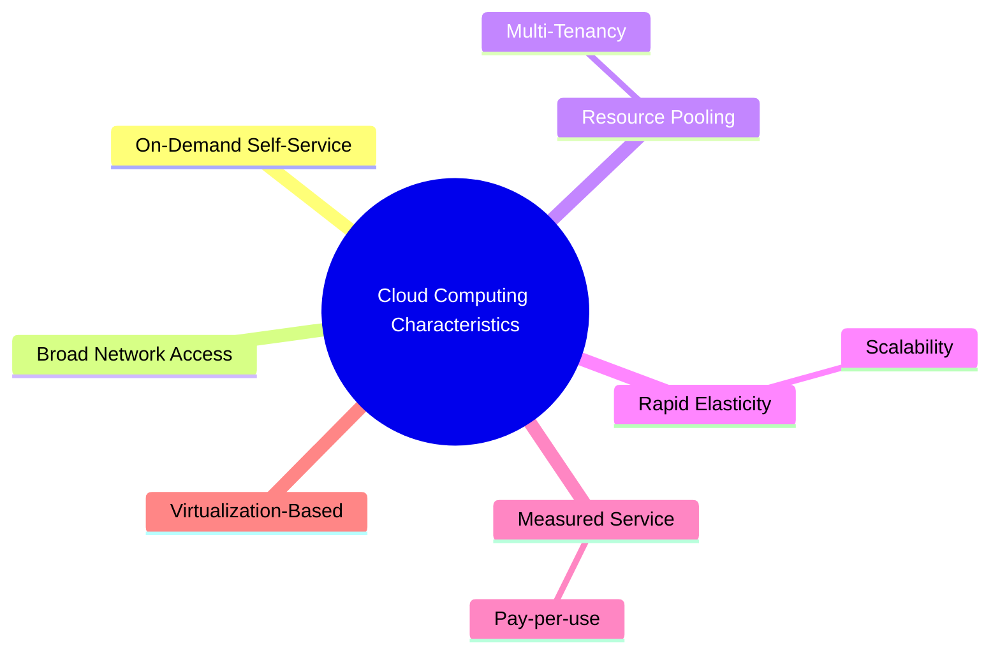
```mermaid
mindmap
  root((Cloud Computing Characteristics))
    On-Demand Self-Service
    Broad Network Access
    Resource Pooling
      Multi-Tenancy
    Rapid Elasticity
      Scalability
    Measured Service
      Pay-per-use
    Virtualization-Based
```

---

### Q2. Describe SaaS, PaaS, and IaaS with examples. (150–200 words)
Cloud computing offers three main service models that provide different levels of control and management.
1. **Software as a Service (SaaS)**
   - Complete applications delivered over the internet.
   - No installation or maintenance required.
   - Multi-tenant architecture.
   - *Examples:* Gmail, Google Docs, Salesforce, Zoom.
   - Ideal for end users.
2. **Platform as a Service (PaaS)**
   - Provides development platforms, frameworks, and tools.
   - Developers focus on coding, not infrastructure.
   - *Examples:* Google App Engine, Heroku, Azure App Services.
   - Ideal for software developers building and testing applications.
3. **Infrastructure as a Service (IaaS)**
   - Provides virtual machines, storage, and networks.
   - Users install OS, databases, and applications.
   - *Examples:* AWS EC2, DigitalOcean Droplets, Azure Virtual Machines.
   - Ideal for system administrators.

**Comparison**
- SaaS offers the least control, IaaS the most.
- PaaS is in the middle with simplified development capabilities.

**Conclusion**
These models provide a flexible structure for delivering cloud resources to different types of users.

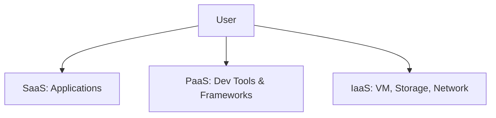
```mermaid
graph TD
    User[User]
    SaaS[SaaS: Applications]
    PaaS[PaaS: Dev Tools & Frameworks]
    IaaS[IaaS: VM, Storage, Network]
    
    User --> SaaS
    User --> PaaS
    User --> IaaS
```

---

### Q3. Explain the cloud deployment models. (150–200 words)
Cloud deployment models define how cloud infrastructure is delivered and who can access it.
1. **Public Cloud**
   - Services offered to the general public.
   - Operated by cloud providers like AWS, Azure, Google Cloud.
   - Low cost, highly scalable, accessible globally.
2. **Private Cloud**
   - Dedicated to a single organization.
   - Provides high security, control, and customization.
   - Can be on-premise or hosted by vendors.
   - Used by banks, defense, and government.
3. **Community Cloud**
   - Shared by multiple organizations with common interests.
   - Used by research institutes, universities, healthcare groups.
   - Offers shared governance and compliance.
4. **Hybrid Cloud**
   - Combines private and public clouds.
   - Sensitive data stored privately, while the public cloud handles workload spikes.
   - *Example:* A company stores confidential data on a private cloud but uses AWS for scalability.

**Comparison**
- Public: low cost, less control
- Private: high cost, more control
- Hybrid: balanced approach
- Community: specialized sharing

**Conclusion**
Organizations select a deployment model based on security, budget, performance, and regulation.

---

### Q4. Advantages of Cloud Computing over Traditional IT. (150–200 words)
Cloud computing provides many advantages compared to traditional IT infrastructures.
1. **Cost Efficiency**
   - No upfront hardware investment.
   - Pay only for what is used (OPEX model).
   - Reduces power, cooling, and maintenance cost.
2. **Scalability & Elasticity**
   - Automatic scaling based on user demand.
   - Traditional IT requires manual upgrades.
3. **Faster Deployment**
   - Provisioning servers takes minutes, not days.
   - Rapid testing, development, and deployment cycles.
4. **High Availability & Reliability**
   - Cloud providers use multiple data centers.
   - Built-in redundancy ensures continuous service.
5. **Maintenance-Free Infrastructure**
   - Providers handle updates, security patches, and backups.
   - Reduces workload on IT teams.
6. **Mobility & Accessibility**
   - Data accessible from anywhere via the internet.
   - Supports remote employees.
7. **Better Collaboration**
   - Shared applications improve team productivity.
   - *Example:* Google Workspace.

**Comparison**
Traditional IT is expensive, slow to scale, and difficult to maintain. Cloud IT is flexible, scalable, and economical.

**Conclusion**
Cloud computing offers superior performance, efficiency, and convenience for modern businesses.

---

## 📘 UNIT 2 – ALL 7 MARK ANSWERS (150–200 WORDS, POINTWISE, WELL-ORGANIZED)

### Q1. What is Virtualization? Explain its types with examples. (150–200 words)
**Meaning of Virtualization**
Virtualization is a technology that allows multiple virtual systems (VMs) to run on a single physical machine by abstracting hardware resources. It improves resource utilization, isolation, flexibility, and forms the backbone of modern cloud computing.

**Types of Virtualization**
1. **Hardware / Server Virtualization**
   - Hypervisor sits directly on hardware and creates multiple virtual machines.
   - *Example:* VMware ESXi, Microsoft Hyper-V.
2. **Operating System Virtualization (Containers)**
   - A single OS kernel runs multiple isolated containers.
   - Lightweight and fast.
   - *Example:* Docker, LXC.
3. **Storage Virtualization**
   - Multiple storage devices are combined into a single virtual storage pool.
   - *Example:* RAID, SAN storage virtualization.
4. **Network Virtualization**
   - Virtual switches, routers, firewalls created via software.
   - *Example:* VMware NSX, Cisco ACI.
5. **Desktop Virtualization**
   - User desktops run as VMs on a central server.
   - *Example:* VDI solutions like VMware Horizon.

**Conclusion**
Virtualization maximizes efficiency, reduces cost, supports isolation, and enables scalable cloud environments.

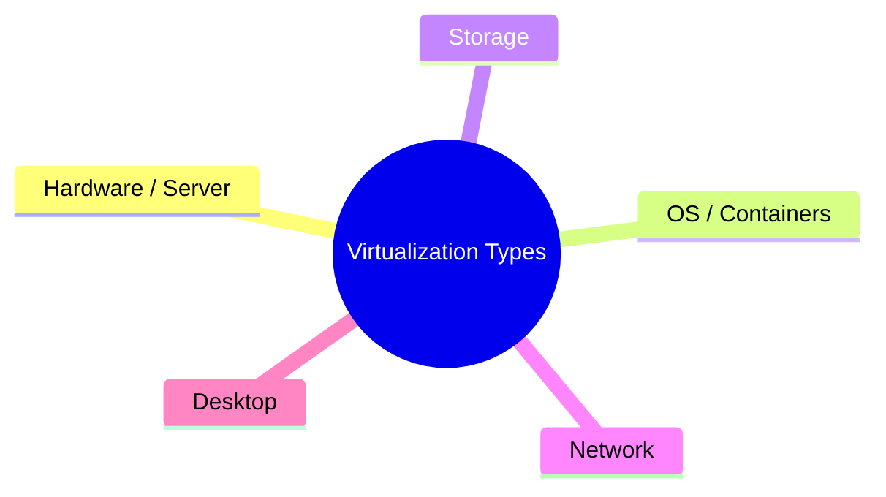
```mermaid
mindmap
  root((Virtualization Types))
    Hardware / Server
    OS / Containers
    Storage
    Network
    Desktop
```

---

### Q2. What is a Hypervisor? Explain Type 1 and Type 2 Hypervisors with examples. (150–200 words)
**Meaning of Hypervisor**
A hypervisor (Virtual Machine Monitor) is software responsible for creating, running, and managing multiple virtual machines on a single physical system. It divides resources such as CPU, memory, and storage among VMs while ensuring isolation.

**Type 1 Hypervisor (Bare-Metal)**
- Runs directly on the hardware without a host OS.
- High performance, high security.
- Used in data centers and cloud environments.
- *Examples:* VMware ESXi, Microsoft Hyper-V, Citrix XenServer.
- *Advantages:* Low latency, efficient resource use, suitable for enterprise workloads.

**Type 2 Hypervisor (Hosted)**
- Runs on top of a host operating system.
- Easier to install; used for testing, learning, or development.
- *Examples:* Oracle VirtualBox, VMware Workstation, Parallels Desktop.
- *Advantages:* Easy to use, supports multiple OS environments on a single PC.

**Conclusion**
Both hypervisors are essential: Type 1 for large-scale production systems and Type 2 for small-scale personal or development environments.

---

### Q3. Explain Grid Computing. How is it different from Cloud Computing and Utility Computing? (150–200 words)
**Meaning of Grid Computing**
Grid computing is a distributed computing model where geographically separated computers work together to solve large computational problems. It breaks a large task into smaller parts processed in parallel.

**Features of Grid Computing**
- Distributed across multiple locations
- Uses idle CPU cycles
- High performance and parallelism
- Often used in scientific research

**Differences from Cloud Computing**
1. **Purpose**
   - Grid: Distributed computation
   - Cloud: On-demand IT services (SaaS, PaaS, IaaS)
2. **Architecture**
   - Grid: Loosely coupled systems
   - Cloud: Centralized virtualized infrastructure
3. **Scalability**
   - Grid: Depends on participating systems
   - Cloud: Virtually unlimited via data centers

**Differences from Utility Computing**
1. **Billing**
   - Utility: Pay-per-use billing
   - Grid: Usually no metered billing
2. **Focus**
   - Utility: Cost & consumption
   - Grid: Computational power

**Examples**
SETI@Home, CERN computing grid.

**Conclusion**
Grid computing focuses on computation, cloud on service delivery, and utility computing on billing.

---

### Q4. What is Utility Computing? Explain its features and benefits. (150–200 words)
**Meaning of Utility Computing**
Utility computing is a model where computing resources such as CPU, storage, and network are provided like electricity — on a pay-per-use basis. Users consume resources as needed and pay only for actual usage.

**Key Features**
1. **On-Demand Resource Access**
   - Resources provision instantly when required.
2. **Pay-as-You-Use Pricing**
   - Billing based on consumption (CPU hours, GB storage).
3. **Resource Pooling**
   - Large pool of shared resources serves multiple users.
4. **Scalability**
   - Resources scale dynamically based on workload.
5. **Metering & Monitoring**
   - Tracks usage accurately for billing.

**Benefits**
1. **Reduced Upfront Cost**
   - No need to purchase expensive hardware.
2. **Improved Efficiency**
   - Users consume only what they need.
3. **Easy Scaling**
   - Applications scale automatically with demand.
4. **Lower Maintenance Burden**
   - Providers handle infrastructure management.

**Examples**
AWS EC2 billing, Google Compute Engine billing, Azure VM consumption model.

**Conclusion**
Utility computing is the foundation of cloud billing and enables cost-effective, flexible IT consumption.

---

### Q5. Explain Elastic Computing and its importance in Cloud Computing. (150–200 words)
**Meaning of Elastic Computing**
Elastic computing refers to the ability of cloud systems to automatically scale computing resources (CPU, RAM, storage) up or down based on user demand.

**How Elasticity Works**
- Continuously monitors workload.
- Adds resources during high traffic.
- Removes resources during low usage.
- Done using load balancers, auto-scaling groups, and monitoring tools.

**Importance in Cloud Computing**
1. **Handles Variable Workloads**
   - Essential for applications with unpredictable traffic.
   - *Example:* E-commerce during sales.
2. **Prevents Over-Provisioning**
   - Reduces wastage of unused resources.
3. **Prevents Under-Provisioning**
   - Ensures apps do not crash during peak traffic.
4. **Cost Optimization**
   - Pay only for the resources actually used.
5. **High Availability**
   - Additional instances improve performance and reliability.

**Real-World Examples**
- AWS Auto Scaling
- Kubernetes Horizontal Pod Autoscaler
- Azure Virtual Machine Scale Sets

**Conclusion**
Elastic computing ensures performance, cost efficiency, and adaptability, making it one of the most critical features of cloud platforms.

---

### Q6. What is Multitenant Architecture? Explain multi-entity and multi-schema models. (150–200 words)
**Meaning of Multitenancy**
Multitenant architecture is a cloud software model where a single application instance serves multiple users (tenants) while keeping their data separated. It is widely used in SaaS platforms.

1. **Multi-Entity Model**
   - Each tenant has a separate database.
   - Provides high security and strong isolation.
   - Easy to customize per tenant.
   - Suitable for banks, enterprises, or regulated industries.
   - *Example:* Each company on Salesforce having its own DB instance.
2. **Multi-Schema Model**
   - One shared database for all tenants.
   - Each tenant gets a separate schema (tables).
   - Easy to maintain and update.
   - Efficient in storage and server resources.
   - *Example:* Gmail where all users share the same database.

**Benefits of Multitenancy**
- Lower cost for providers
- Easy upgrades (single codebase)
- Better scalability
- Efficient resource sharing

**Conclusion**
Both models effectively support multi-user cloud applications. Multi-entity offers stronger isolation, while multi-schema offers better efficiency and easier maintenance.

---

### Q7. Discuss the pitfalls of Virtualization. (150–200 words)
1. **Performance Overhead**
   - VMs run through a hypervisor, causing slower performance compared to bare metal.
   - Not ideal for extremely high-performance applications.
2. **VM Sprawl**
   - Too many VMs get created without management.
   - Leads to wasted storage, increased cost, and security risks.
3. **Security Vulnerabilities**
   - Hypervisor attacks (VM escape) can allow attackers to access multiple VMs.
   - Misconfigured VMs cause data leaks.
4. **Licensing & Cost Issues**
   - Requires multiple licenses for OS, hypervisor, and VM management tools.
5. **Hardware Dependency**
   - Some hypervisors require advanced hardware features like VT-x or AMD-V.
   - Limits compatibility.
6. **Complex Backup & Snapshot Management**
   - Storing many VM snapshots consumes significant storage.
   - Improper management leads to slow performance.
7. **Management Complexity**
   - Requires skilled administrators for monitoring, security, and optimization.

**Conclusion**
Virtualization provides major benefits, but without proper management, it introduces overheads, security risks, and operational challenges.

---

### Q8. Explain the role of Virtualization in HPC (High-Performance Computing). (150–200 words)
1. **Dynamic Resource Allocation**
   - Virtualization allocates CPU, memory, and storage based on workload requirements.
   - Ensures efficient use of cluster resources.
2. **Parallel Processing**
   - HPC workloads are distributed across multiple VMs.
   - Ideal for simulations, scientific computing, and machine learning.
3. **Isolation of Workloads**
   - Prevents interference between different research or enterprise tasks.
   - Improves reliability and fault tolerance.
4. **Portability & Migration**
   - Virtual machines can be migrated easily across servers.
   - Enables load balancing and maintenance without downtime.
5. **Rapid Deployment**
   - Virtual clusters can be created quickly using VM templates.
   - Faster setup for research labs and institutions.
6. **Cost Efficiency**
   - Makes HPC possible using commodity hardware.
   - Reduces the need for expensive dedicated clusters.

**Examples**
- Virtualized HPC on OpenStack
- Cloud-based HPC on AWS (EC2 HPC instances)

**Conclusion**
Virtualization enhances flexibility, cost savings, scalability, and ease of management in HPC environments.

---

### Q9. What are the applications of Virtualization in Enterprises? (150–200 words)
1. **Server Consolidation**
   - Multiple physical servers replaced with VMs.
   - Reduces hardware cost, power usage, and space.
2. **Disaster Recovery & Backup**
   - VMs can be backed up, cloned, or restored easily.
   - Faster recovery after failures.
3. **Development & Testing**
   - Developers create multiple test environments on a single machine.
   - Supports different OS versions without extra hardware.
4. **Desktop Virtualization**
   - Centralized control of employee desktops via VDI.
   - Enhances security and reduces maintenance.
5. **Cloud Deployment**
   - Virtualization is the foundation of IaaS cloud.
   - Enterprises use VMware, KVM, Xen for private clouds.
6. **Security Isolation**
   - Applications run in isolated VMs, reducing attack impact.
7. **Network & Storage Virtualization**
   - Software-defined networks and storage simplify management.

**Examples**
Banks, e-commerce, IT companies, hospitals use virtualization to reduce cost and improve operations.

**Conclusion**
Virtualization is essential for enterprise IT due to its efficiency, cost savings, flexibility, and management simplicity.

---

### Q10. Compare Utility Computing, Grid Computing, and Elastic Computing. (150–200 words)
**Utility Computing**
- Pay-per-use computing model.
- Resources billed based on consumption.
- Focus: Cost efficiency.
- *Example:* AWS EC2 billing.

**Grid Computing**
- Distributed computing coordinated across many computers.
- Focus: Large-scale parallel computation.
- *Example:* SETI@Home, CERN Grid.

**Elastic Computing**
- Automatically scales resources based on demand.
- Focus: Performance and flexibility.
- *Example:* AWS Auto Scaling, Kubernetes HPA.

**Comparison Table**

| Feature | Utility | Grid | Elastic |
| :--- | :--- | :--- | :--- |
| **Billing** | Yes | No | Pay-as-use |
| **Purpose** | Cost control | Computation | Scaling |
| **Architecture** | Centralized | Distributed | Cloud-based |
| **Scalability** | Moderate | High | Automatic high |

**Conclusion**
Utility computing focuses on cost, grid computing focuses on distributed computation, and elastic computing focuses on automatic scaling—each serving different cloud and computing needs.

---

## 📘 UNIT 3 – FULL 7 MARK ANSWERS (150–200 WORDS, POINTWISE, WELL-ORGANIZED)

### Q1. Explain organizational scenarios for adopting cloud computing. (150–200 words)
**Meaning**
Organizational scenarios refer to how different types of organizations adopt cloud computing based on their business needs, budget, security requirements, and workload characteristics.
1. **Startups and Small Businesses**
   - Prefer public cloud due to low cost.
   - Need rapid deployment and scalability.
   - *Example:* A startup hosting its app on AWS EC2 or Firebase.
2. **Medium Enterprises**
   - Use hybrid clouds to balance cost and security.
   - Keep sensitive data in private cloud and run workloads in public cloud.
3. **Large Enterprises**
   - Use private or hybrid clouds for compliance, performance, and integration with legacy systems.
   - *Example:* Banks using private cloud for core banking and public cloud for analytics.
4. **Research Institutions**
   - Use cloud for high-performance computing, AI models, and data storage.
   - Benefit from elastic scaling.
5. **Government and Defense**
   - Require high security and data sovereignty.
   - Use private/community clouds.

**Conclusion**
Cloud adoption varies based on organization size, cost sensitivity, security needs, and workload type. Each organization selects a deployment model that best meets its operational goals.

---

### Q2. Explain administering and monitoring cloud services. (150–200 words)
**Meaning**
Administering and monitoring cloud services refers to the process of managing cloud resources, performance, health, security, and cost using cloud management tools.
1. **Resource Provisioning**
   - Administrators launch VMs, storage, and databases.
   - Use tools like AWS Console, Azure Portal, Google Cloud Console.
2. **Performance Monitoring**
   - Track CPU, RAM, disk usage, network traffic.
   - *Example:* AWS CloudWatch, Azure Monitor.
3. **Security Monitoring**
   - Manage IAM roles, access control, encryption keys.
   - Detect threats through services like AWS GuardDuty.
4. **Cost Monitoring**
   - Track billing, set budget alerts, optimize underutilized resources.
   - *Example:* Google Cloud Billing Dashboard.
5. **Logging & Auditing**
   - Logs help in debugging, security audits, and compliance checks.
   - *Example:* AWS CloudTrail.
6. **Auto-Scaling & Automation**
   - Administrators configure auto-scaling based on performance metrics.

**Conclusion**
Effective cloud administration ensures optimal resource usage, security, performance, availability, and cost-efficiency.

---

### Q3. Explain load balancing in cloud computing. (150–200 words)
**Meaning**
Load balancing distributes incoming workload across multiple servers or resources to improve performance, reliability, and availability of cloud services.
1. **Traffic Distribution**
   - Load balancers route user requests to servers with the least load.
   - Ensures no server becomes overloaded.
2. **Types of Load Balancing**
   - Hardware Load Balancers: Physical appliances used in data centers.
   - Software Load Balancers: Installed on servers; scalable and flexible.
   - Cloud Load Balancers: Managed by cloud providers (most common).
3. **Techniques Used**
   - Round Robin
   - Least Connections
   - IP Hash
   - Weighted Distribution
4. **Benefits**
   - Eliminates single point of failure
   - Ensures high availability
   - Improves response time
   - Supports auto-scaling

**Examples**
- AWS Elastic Load Balancer (ELB)
- Azure Load Balancer
- Google Cloud Load Balancing

**Conclusion**
Load balancing is critical for maintaining service continuity and handling large-scale user traffic in cloud environments.

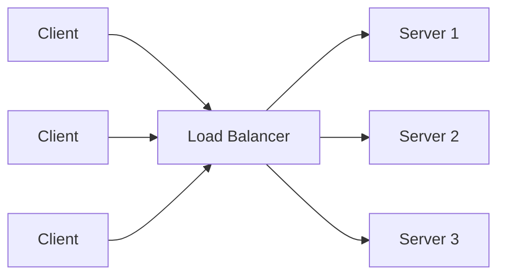
```mermaid
graph LR
    Client1[Client] --> LB[Load Balancer]
    Client2[Client] --> LB
    Client3[Client] --> LB
    LB --> Server1[Server 1]
    LB --> Server2[Server 2]
    LB --> Server3[Server 3]
```

---

### Q4. Explain resource optimization in cloud computing. (150–200 words)
**Meaning**
Resource optimization ensures that cloud resources such as CPU, storage, and network are consumed efficiently, minimizing cost and maximizing performance.
1. **Right-Sizing Resources**
   - Selecting appropriate VM sizes (not too large or too small).
   - *Example:* Choosing t3.micro over t2.large to reduce costs.
2. **Auto-Scaling**
   - Automatically adding/removing servers based on demand.
3. **Storage Optimization**
   - Deleting unused volumes, snapshots, logs.
   - Using lifecycle policies for S3.
4. **Load Balancing**
   - Distributing workload prevents overloading a single machine.
5. **Caching**
   - Reducing repeated computation and database load.
   - *Example:* Using Redis or CloudFront.
6. **Monitoring**
   - Tools like AWS CloudWatch help identify idle resources.
7. **Cost Optimization**
   - Using reserved instances, spot instances, or committed-use discounts.

**Conclusion**
Resource optimization reduces cloud bills, improves performance, and ensures efficient infrastructure utilization.

---

### Q5. Explain resource dynamic reconfiguration. (150–200 words)
**Meaning**
Dynamic reconfiguration refers to automatically adjusting cloud resources (CPU, memory, storage) while the system is running, without downtime.
1. **Vertical Scaling (Scale-Up)**
   - Increasing resources of an existing VM (more RAM, CPU).
   - *Example:* Upgrading AWS EC2 instance from t3.micro to t3.medium.
2. **Horizontal Scaling (Scale-Out)**
   - Adding more VM instances.
   - Used for web applications with varying loads.
3. **Hot-Plugging Resources**
   - Adding CPU or RAM without rebooting a VM.
   - Supported in VMware and some cloud VMs.
4. **Auto-Scaling Policies**
   - Triggered based on metrics like CPU > 70%.
   - Automatically adds/removes instances.
5. **Benefits**
   - Avoids downtime
   - Handles workload spikes
   - Maximizes resource efficiency
   - Improves user experience
6. **Use Cases**
   - Streaming apps, gaming servers, real-time analytics, financial trading platforms.

**Conclusion**
Dynamic reconfiguration ensures smooth performance and continuous operation without manual intervention.

---

### Q6. Explain implementing real-time applications in cloud. (150–200 words)
**Meaning**
Real-time applications require instant processing, low latency, and continuous availability. Cloud platforms support real-time systems through high-speed networking, distributed architecture, and scalable infrastructure.
1. **Real-Time Requirements**
   - Low latency
   - High throughput
   - Fault tolerance
   - Fast response (milliseconds)
2. **Cloud Support Features**
   - Content Delivery Networks (CDN) for fast delivery
   - Auto-scaling for handling unpredictable load
   - Load balancers for distribution
   - In-memory databases for fast access (Redis, Memcached)
3. **Architecture Elements**
   - Microservices architecture
   - WebSockets for live communication
   - Event streaming tools like Kafka, AWS Kinesis
4. **Examples of Real-Time Cloud Apps**
   - Online gaming
   - Video conferencing (Zoom, Google Meet)
   - Stock trading systems
   - IoT real-time monitoring (AWS IoT)

**Conclusion**
Cloud computing offers scalable, low-latency, globally distributed infrastructure, making it ideal for building reliable real-time applications.

---

### Q7. Explain Mobile Cloud Computing (MCC). (150–200 words)
**Meaning**
Mobile Cloud Computing combines mobile computing and cloud computing to deliver applications and services to mobile devices using cloud infrastructure.
1. **Architecture**
   - Mobile device (frontend)
   - Cloud backend (processing, storage, security)
   - Wireless networks connecting both
2. **Benefits**
   - Offloads heavy processing from mobile devices to cloud
   - Extends battery life
   - Supports large storage
   - Enables cross-device synchronization
   - Provides scalability for mobile apps
3. **Applications**
   - Mobile gaming
   - Social media apps (Instagram, Facebook)
   - Voice assistants (Google Assistant)
   - Mobile banking apps
4. **Challenges**
   - Network latency issues
   - Security and privacy concerns
   - Dependency on internet connectivity

**Examples**
- Google Photos storing images in cloud
- PUBG Mobile using cloud servers
- Siri processing voice commands via cloud

**Conclusion**
MCC enhances mobile capabilities by using cloud power, resulting in better performance, storage, and user experience.

---

### Q8. Explain Edge Computing. (150–200 words)
**Meaning**
Edge computing processes data at or near the source of data generation (edge devices) instead of sending it to a centralized cloud.
1. **Architecture**
   - Edge devices (IoT sensors, cameras)
   - Edge servers / gateways
   - Cloud backend for analytics & storage
2. **Advantages**
   - Low latency
   - Faster processing
   - Reduced bandwidth usage
   - Better reliability
   - Enhanced privacy (local data processing)
3. **Use Cases**
   - Autonomous vehicles
   - Smart cities
   - Industrial IoT
   - Healthcare monitoring
   - Real-time surveillance
4. **Differences: Cloud vs Edge**
   - Cloud: Centralized processing, higher latency
   - Edge: Local processing, low latency

**Examples**
- Tesla Autopilot processing data on edge devices
- Amazon Go stores using local edge servers for instant billing
- Smart traffic signals using edge AI

**Conclusion**
Edge computing is essential for real-time, low-latency applications and works together with cloud computing to improve performance and intelligence.

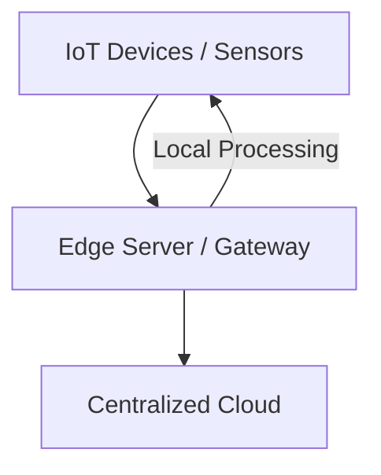
```mermaid
graph TD
    IoT[IoT Devices / Sensors] --> Edge[Edge Server / Gateway]
    Edge --> Cloud[Centralized Cloud]
    Edge -- Local Processing --> IoT
```

---

## 📘 UNIT 4 – CLOUD SECURITY & ISSUES (ALL 7 MARK ANSWERS)
(150–200 words, pointwise, examples, no extra lines)

### Q1. Explain Cloud Security Fundamentals. (150–200 words)
**Meaning**
Cloud security is the collection of technologies, controls, and practices used to protect cloud data, applications, and infrastructure from threats.
1. **Confidentiality**
   - Ensures only authorized users can access data.
   - Achieved using encryption (AES-256), Identity and Access Management (IAM).
   - *Example:* Encrypting S3 buckets in AWS.
2. **Integrity**
   - Protects data from unauthorized modification.
   - Uses hashing (SHA-256), digital signatures, versioning.
3. **Availability**
   - Ensures systems remain operational without downtime.
   - Achieved through load balancing, failover, and auto-scaling.
4. **Authentication & Authorization**
   - Authentication verifies identity (password, biometrics).
   - Authorization grants permissions.
   - *Example:* IAM roles in AWS.
5. **Security Controls**
   - Preventive controls: Firewalls, access control policies
   - Detective controls: Logs, monitoring
   - Corrective controls: Backups, disaster recovery
6. **Shared Responsibility Model**
   - Cloud provider handles infrastructure security.
   - Customer handles application and data security.

**Conclusion**
Cloud security fundamentals ensure confidentiality, integrity, and availability, making cloud environments safe and reliable.

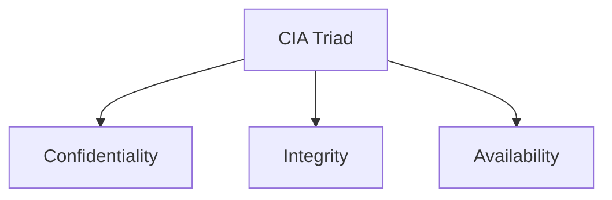
```mermaid
graph TD
    CIA[CIA Triad]
    CIA --> C[Confidentiality]
    CIA --> I[Integrity]
    CIA --> A[Availability]
```

---

### Q2. Explain general issues and challenges while migrating to cloud. (150–200 words)
1. **Data Security & Privacy Concerns**
   - Sensitive data moves outside the organization.
   - Risk of breaches, unauthorized access.
   - Requires encryption, IAM, and compliance checks.
2. **Compatibility with Legacy Systems**
   - Old applications may not be cloud-ready.
   - Refactoring or containerizing may be needed.
3. **Downtime During Migration**
   - Services may face temporary unavailability.
   - Needs planned migration, backups, and failover.
4. **Data Transfer Costs and Time**
   - Large datasets require high bandwidth.
   - Cloud vendors may charge for transfers.
5. **Vendor Lock-In**
   - Difficult to shift from one cloud provider to another.
   - Different platforms use different architectures.
6. **Legal and Compliance Issues**
   - Data sovereignty laws vary between countries.
   - Organizations must comply with standards like GDPR, HIPAA.
7. **Skill Gap**
   - Employees need cloud training.
   - New tools and technologies must be learned.

**Conclusion**
Cloud migration provides benefits but must be handled carefully to avoid security, compatibility, and compliance challenges.

---

### Q3. Explain the seven-step model of cloud migration. (150–200 words)
1. **Step 1 – Assess**
   - Identify business objectives, workloads, and dependencies.
   - Evaluate risks, performance needs, and security requirements.
2. **Step 2 – Pilot**
   - Test migration on a small selected application.
   - Validate tools, methods, and performance.
3. **Step 3 – Identify Application Profiles**
   - Categorize applications based on CPU, memory, storage, and security needs.
   - Select migration strategies (Rehost, Replatform, Refactor).
4. **Step 4 – Select Cloud Providers**
   - Choose among AWS, Azure, GCP based on cost, features, and compliance.
5. **Step 5 – Migration Planning**
   - Create a detailed timeline.
   - Plan database migration, networking, backup, and rollback strategies.
6. **Step 6 – Migration Execution**
   - Move data, applications, and services to cloud.
   - Validate performance and integration with cloud services.
7. **Step 7 – Optimization**
   - Improve security, automate scaling, tune resources.
   - Perform continuous monitoring.

**Conclusion**
The seven-step model ensures safe, systematic, and effective migration from traditional systems to cloud computing.

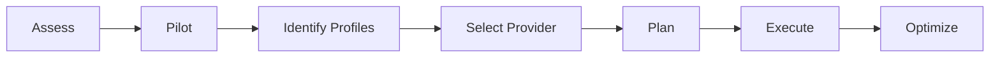
```mermaid
graph LR
    S1[Assess] --> S2[Pilot]
    S2 --> S3[Identify Profiles]
    S3 --> S4[Select Provider]
    S4 --> S5[Plan]
    S5 --> S6[Execute]
    S6 --> S7[Optimize]
```

---

### Q4. Explain vulnerability assessment tools for cloud. (150–200 words)
**Meaning**
Vulnerability assessment identifies weaknesses in cloud systems to prevent attacks, data breaches, and service failures.
1. **Nessus**
   - Popular scanner that detects OS vulnerabilities, misconfigurations, and outdated packages.
   - Provides detailed reports and risk scores.
2. **OpenVAS**
   - Open-source vulnerability scanner.
   - Detects network vulnerabilities, weak passwords, and open ports.
3. **Qualys Cloud Security**
   - Cloud-based scanner for VMs, containers, and applications.
   - Provides continuous monitoring.
4. **Nmap**
   - Network scanning tool that identifies open ports and services.
   - Detects potential attack paths.
5. **AWS Inspector / Azure Security Center**
   - Cloud-native vulnerability detection.
   - Identifies weaknesses in EC2 instances, VM images, IAM policies.
6. **Burp Suite**
   - Web application vulnerability scanner.
   - Detects SQL injection, XSS, CSRF vulnerabilities.

**Importance**
- Helps secure cloud environments
- Prevents exploitation
- Ensures compliance
- Reduces risk exposure

**Conclusion**
Vulnerability assessment tools enhance cloud security by detecting threats early and ensuring system resilience.

---

### Q5. Explain Trusted Cloud Computing. (150–200 words)
**Meaning**
Trusted Cloud Computing ensures that cloud services are secure, reliable, and meet compliance requirements through strong policies, hardware security, and verified operations.
1. **Trusted Platform Module (TPM)**
   - Hardware chip ensuring device integrity.
   - Used for secure boot, encryption keys.
2. **Secure Execution Environments**
   - Uses Virtual Trusted Execution Environments (vTEE) to isolate workloads.
   - Prevents unauthorized access to sensitive computations.
3. **Identity and Access Management**
   - Strong access controls, MFA, role-based access.
   - Ensures only authorized users access resources.
4. **Data Encryption**
   - End-to-end encryption using AES-256, TLS.
   - Protects data in transit and at rest.
5. **Compliance and Audits**
   - Cloud providers follow standards like ISO 27001, SOC 2, GDPR, HIPAA.
   - Builds customer trust.
6. **Logging and Monitoring**
   - Continuous monitoring helps detect anomalies.
   - Tools: AWS CloudTrail, Azure Security Center.

**Examples**
- Google Cloud’s Titan security chip
- AWS Nitro System enhancing VM isolation

**Conclusion**
Trusted cloud computing builds confidence through strong identity, encryption, hardware security, and compliance mechanisms.

---

### Q6. Explain virtualization security management and virtual machine threats. (150–200 words)
1. **VM Escape Attacks**
   - Attacker breaks isolation and accesses the host or other VMs.
   - Dangerous because multiple systems can be compromised.
2. **VM Sprawl**
   - Too many VMs get created without management.
   - Leads to unmanaged assets and security risks.
3. **Hypervisor Attacks**
   - Attacker targets hypervisor vulnerabilities.
   - If hypervisor is compromised, all VMs are at risk.
4. **Insecure VM Images**
   - Pre-built images may have vulnerabilities or viruses.
   - Requires image scanning and verification.
5. **Snapshot Risks**
   - Snapshots store sensitive memory and disk data.
   - Must be encrypted and controlled.

**Security Management Techniques**
1. **Hardening Hypervisors**
   - Patch updates, secure configurations.
2. **Network Segmentation**
   - Isolating VM networks to reduce attack surface.
3. **Security Monitoring**
   - Use tools like AWS GuardDuty, Azure Sentinel.
4. **Image Scanning**
   - Validate VM templates before deployment.
5. **Encryption**
   - Encrypt VM disks, snapshots, and traffic.

**Conclusion**
Virtualization security management is crucial because vulnerabilities can impact entire cloud environments.

---

### Q7. Explain QoS (Quality of Service) issues in cloud computing. (150–200 words)
**Meaning**
QoS issues refer to factors affecting performance, reliability, and user experience in cloud environments.
1. **Latency Issues**
   - High network delay affects real-time applications.
   - Caused by long distances between user and cloud data center.
2. **Bandwidth Limitations**
   - Limited bandwidth slows data transfer.
   - Impacts video streaming, large backups, and big-data applications.
3. **Availability Problems**
   - Downtime affects business continuity.
   - Cloud service outages (AWS, Azure) may interrupt services.
4. **Resource Contention**
   - In multi-tenant environments, VMs share resources.
   - Overloaded servers cause performance drops.
5. **Service Reliability**
   - Failures in load balancers, DNS, or storage services affect availability.
6. **Security Issues**
   - Attacks such as DDoS affect QoS by overwhelming servers.
7. **SLA Violations**
   - If cloud provider doesn’t meet SLA, performance degrades.

**Solutions**
- Auto-scaling
- Edge computing
- CDNs
- Fault-tolerant architectures
- QoS monitoring tools

**Conclusion**
QoS issues impact cloud performance; proper optimization ensures reliability and better user experience.

---

### Q8. Explain data migration challenges and risks in cloud adoption. (150–200 words)
1. **Data Volume & Transfer Time**
   - Large datasets require high bandwidth and time.
   - Slow migration affects business operations.
2. **Data Loss Risk**
   - Improper migration may cause corruption or loss.
   - Requires proper backup and checksum verification.
3. **Security During Transfer**
   - Data is exposed to cyber threats during transit.
   - Must use SSL/TLS encryption and VPN tunnels.
4. **Compatibility Issues**
   - Database formats, schemas, or application structures may differ.
   - Requires data transformation.
5. **Vendor Lock-In**
   - Once data is stored in a vendor-specific format, migrating out becomes difficult.
   - *Example:* Different storage APIs in AWS S3 vs Azure Blob.
6. **Downtime**
   - Applications may need to pause during migration.
   - Affects business performance.
7. **Legal & Compliance Risks**
   - Data sovereignty laws restrict cross-border migration.
   - Sensitive data must remain within local jurisdiction.

**Conclusion**
Migrating data to cloud requires planning, security, validation, and proper tools to avoid risks and ensure a smooth transition.

---

## 📘 UNIT 5 – CASE STUDIES ON CLOUD PLATFORMS
(OpenStack, Eucalyptus, OpenNebula, Apache CloudStack, AWS, Azure, Google Cloud)
(All answers 150–200 words, properly organized)

### Q1. Explain OpenStack architecture and its components. (150–200 words)
**Meaning**
OpenStack is an open-source cloud computing platform used to build private and public clouds. It provides IaaS through modular, interoperable components.

**Key Components**
1. **Nova (Compute Service)**
   - Manages virtual machines and compute resources.
   - Supports multiple hypervisors like KVM, Xen.
2. **Neutron (Networking)**
   - Provides network connectivity to VMs.
   - Supports VLAN, VXLAN, SDN controllers.
3. **Swift (Object Storage)**
   - Stores unstructured data like images, logs, backups.
   - Highly scalable and fault-tolerant.
4. **Cinder (Block Storage)**
   - Provides persistent block storage similar to virtual hard drives.
5. **Keystone (Identity Service)**
   - Handles authentication, authorization, and service registry.
6. **Glance (Image Service)**
   - Stores VM images and snapshots.
7. **Horizon (Dashboard)**
   - Web interface for managing cloud resources.
8. **Heat (Orchestration)**
   - Automates resource deployment and scaling.

**Conclusion**
OpenStack is widely used by enterprises for building scalable private clouds due to its open-source nature, modular architecture, and strong community support.

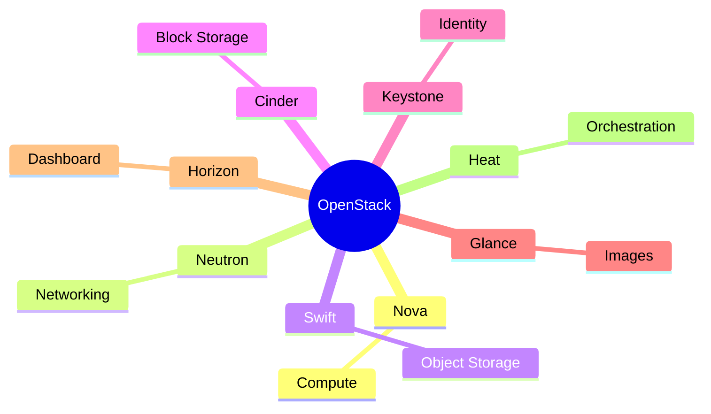
```mermaid
mindmap
  root((OpenStack))
    Nova
      Compute
    Neutron
      Networking
    Swift
      Object Storage
    Cinder
      Block Storage
    Keystone
      Identity
    Glance
      Images
    Horizon
      Dashboard
    Heat
      Orchestration
```

---

### Q2. Explain Eucalyptus cloud platform and its architecture. (150–200 words)
**Meaning**
Eucalyptus (Elastic Utility Computing Architecture for Linking Your Programs To Useful Systems) is an open-source platform used to build private and hybrid clouds with strong compatibility to Amazon AWS.

**Core Components**
1. **Cloud Controller (CLC)**
   - Top-level controller that manages authentication, accounting, and resource allocation.
2. **Cluster Controller (CC)**
   - Manages one or more node controllers.
   - Handles scheduling and network management.
3. **Node Controller (NC)**
   - Controls virtual machine instances on physical servers.
   - Interacts with hypervisors like KVM or Xen.
4. **Walrus Storage Service**
   - Object storage similar to AWS S3.
   - Stores VM images, snapshots, ISO files.
5. **Storage Controller (SC)**
   - Provides block storage similar to AWS EBS.

**Features**
- AWS-compatible APIs (EC2, S3).
- Supports private + hybrid cloud deployments.
- Easy integration with existing data centers.

**Use Cases**
Enterprises wanting AWS-like private clouds without vendor lock-in.

**Conclusion**
Eucalyptus is ideal for organizations needing AWS-compatible private cloud environments with flexible, open-source management.

---

### Q3. Explain OpenNebula and its cloud management capabilities. (150–200 words)
**Meaning**
OpenNebula is an open-source cloud management platform used to build enterprise-grade private, public, and hybrid clouds. It focuses on simplicity, scalability, and flexibility.

**Key Capabilities**
1. **Virtualization Management**
   - Supports KVM, VMware, LXD.
   - Handles VM lifecycle, monitoring, and scheduling.
2. **Elasticity & Auto-Scaling**
   - Automatically adjusts resources based on demand.
3. **Networking (Virtual Networks)**
   - Manages isolated, secure VLAN/VXLAN networks.
4. **Storage Management**
   - Integrates with block, object, and file-based storage.
   - Supports persistent and non-persistent disks.
5. **Hybrid Cloud Support**
   - Extends private cloud to AWS, Azure, and Google Cloud.
6. **User & Group Management**
   - Role-based access control (RBAC).
   - Suitable for multi-tenant environments.
7. **Sunstone GUI**
   - Simple web-based dashboard for administrators and users.

**Advantages**
- Lightweight, easy-to-deploy architecture
- Suitable for research labs, enterprises, and academic institutions

**Conclusion**
OpenNebula offers a balanced, flexible, and user-friendly cloud management solution for organizations wanting efficient private and hybrid cloud environments.

---

### Q4. Explain Apache CloudStack architecture. (150–200 words)
**Meaning**
Apache CloudStack is an open-source cloud management platform used for building private, public, and hybrid IaaS clouds. It is known for its high stability, scalability, and rich API support.

**Core Components**
1. **Management Server**
   - Central controller managing compute, storage, and networking resources.
   - Provides API and UI access.
2. **Hypervisor Support**
   - Integrates with KVM, XenServer, VMware ESXi, Hyper-V.
3. **Zones, Pods, Clusters Architecture**
   - Zone: A data center
   - Pod: Group of servers in a rack
   - Cluster: Hosts sharing storage and hypervisors
   - Offers scalable hierarchical design.
4. **Primary Storage & Secondary Storage**
   - Primary: VM disks
   - Secondary: ISO images, snapshots
5. **Networking Models**
   - Basic networking
   - Advanced networking (VLAN, VPC)
6. **CloudStack UI & API**
   - Web interface for users
   - API for automation

**Features**
- Built-in load balancing firewall, VPN, NAT
- Multi-tenant user management

**Conclusion**
Apache CloudStack is ideal for enterprises needing a stable, production-ready open-source cloud platform with strong scalability.

---

### Q5. Explain AWS (Amazon Web Services) cloud platform with its services. (150–200 words)
**Meaning**
AWS is the world’s largest cloud computing platform providing over 200+ on-demand services including compute, storage, networking, databases, analytics, and AI.

**Major Service Categories**
1. **Compute**
   - EC2 (Virtual Machines)
   - Lambda (Serverless computing)
   - ECS/EKS (Container services)
2. **Storage**
   - S3 (Object storage)
   - EBS (Block storage)
   - Glacier (Archival storage)
3. **Networking**
   - VPC (Virtual private cloud)
   - Route 53 (DNS service)
   - ELB (Load balancing)
4. **Databases**
   - RDS (SQL databases)
   - DynamoDB (NoSQL)
   - Aurora (High-performance database)
5. **Security**
   - IAM (User access)
   - KMS (Encryption)
   - CloudTrail (Logging)
6. **Machine Learning**
   - SageMaker for ML model development.

**Advantages**
- Global infrastructure
- High availability
- Wide variety of services
- Pay-as-you-use pricing

**Conclusion**
AWS is ideal for startups, enterprises, and developers needing scalable, secure, and feature-rich cloud services.

---

### Q6. Explain Microsoft Azure platform and its services. (150–200 words)
**Meaning**
Microsoft Azure is a cloud platform offering more than 200 services including compute, networking, storage, databases, AI, DevOps, and analytics.

**Major Services**
1. **Compute Services**
   - Azure Virtual Machines
   - Azure Functions (Serverless)
   - AKS (Kubernetes)
2. **Storage Services**
   - Blob Storage
   - Disk Storage
   - Azure Files
3. **Database Services**
   - SQL Database
   - Cosmos DB (NoSQL)
   - Azure Database for MySQL/PostgreSQL
4. **Networking**
   - Virtual Network
   - Azure Load Balancer
   - VPN Gateway
5. **AI & Machine Learning**
   - Azure Cognitive Services
   - Azure Machine Learning
6. **Security**
   - Azure Active Directory (AAD)
   - Azure Security Center

**Advantages**
- Strong integration with Windows Server and Office 365
- Hybrid cloud support with Azure Arc
- Global availability

**Conclusion**
Azure is preferred by enterprises utilizing Microsoft technologies and those requiring hybrid solutions.

---

### Q7. Explain Google Cloud Platform (GCP) and its services. (150–200 words)
**Meaning**
Google Cloud Platform is a cloud computing service known for analytics, machine learning, and high-performance computing.

**Major Services**
1. **Compute**
   - Compute Engine (VMs)
   - Cloud Run (Serverless containers)
   - GKE (Google Kubernetes Engine)
2. **Storage**
   - Cloud Storage
   - Persistent Disks
   - Filestore
3. **Databases**
   - Cloud SQL
   - Firestore
   - Bigtable
4. **Networking**
   - VPC
   - Cloud Load Balancing
   - Cloud CDN
5. **AI & Machine Learning**
   - Vertex AI
   - TensorFlow integration
6. **Big Data Analytics**
   - BigQuery (Serverless data warehouse)
   - Dataflow (Stream processing)

**Advantages**
- Strong in AI/ML
- High-speed global fiber network
- Cost-efficient models like Preemptible VMs

**Conclusion**
GCP is ideal for data-intensive applications, AI research, analytics, and high-performance computing.

---

## 📘 PART 1 — Q1 TO Q5 (WITH BIGGER, CLEAR HEADINGS)
(150–200 words each, pointwise, exam-ready)

### Q1) Describe the essential characteristics of Cloud Computing as defined by NIST.
**Definition**
NIST defines cloud computing as a model for enabling convenient, on-demand network access to shared configurable computing resources.

**Essential NIST Characteristics**
1. **On-Demand Self-Service**
   - Users provision computing resources (VMs, storage) without human intervention.
   - *Example:* Creating an AWS EC2 instance instantly.
2. **Broad Network Access**
   - Services accessed over standard networks using phones, tablets, laptops.
   - *Example:* Accessing Google Docs from any device.
3. **Resource Pooling (Multi-Tenancy)**
   - Provider resources pooled to serve many customers.
   - Resources automatically assigned/reassigned.
   - *Example:* Multiple tenants sharing the same physical server via virtualization.
4. **Rapid Elasticity**
   - Resources scale quickly based on demand.
   - Appears unlimited to consumers.
   - *Example:* Auto-scaling during festival sale traffic.
5. **Measured Service**
   - Metering for CPU, storage, bandwidth.
   - Enables pay-as-you-use pricing.
   - *Example:* Billing EC2 by the hour/second.

**Conclusion**
These characteristics give cloud computing its key benefits: scalability, cost efficiency, flexibility, and global accessibility.

---

### Q2) Explain the Cloud Computing Reference Model with a neat diagram.
**Purpose**
The Cloud Reference Model explains how cloud components and service layers interact.

**Layers of the Reference Model**
1. **Cloud Consumers**
   - End-users and organizations using cloud services.
2. **Service Layer**
   - SaaS: Complete apps (e.g., Gmail, Salesforce).
   - PaaS: Development environments (e.g., Google App Engine, Heroku).
   - IaaS: Virtualized hardware (e.g., EC2, Azure VMs).
3. **Cloud Provider Platform Layer**
   - Orchestration, scheduling, hypervisors, APIs, identity services.
4. **Physical Infrastructure Layer**
   - Servers, networking, storage, data center hardware.
5. **Cross-cutting Security & Management**
   - Monitoring, logging, IAM, policy control, billing, SLAs.

**Neat Text Diagram**
```
      Cloud Consumers
            ↓
     +----------------+
     |     SaaS       |
     +----------------+
     |     PaaS       |
     +----------------+
     |     IaaS       |
     +----------------+
     | Orchestration  |
     |   & APIs       |
     +----------------+
     |  Physical DC   |
     +----------------+
   (Security & Management apply across all layers)
```

**Conclusion**
This model clearly separates responsibilities and abstraction levels, making cloud architecture easier to design and understand.

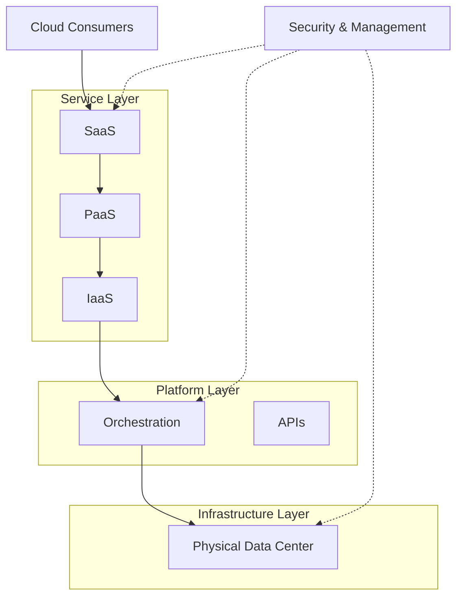
```mermaid
graph TD
    Consumer[Cloud Consumers]
    
    subgraph SL [Service Layer]
    SaaS
    PaaS
    IaaS
    end
    
    subgraph PL [Platform Layer]
    Orchestration
    APIs
    end
    
    subgraph IL [Infrastructure Layer]
    Physical_DC[Physical Data Center]
    end
    
    Consumer --> SaaS
    SaaS --> PaaS
    PaaS --> IaaS
    IaaS --> Orchestration
    Orchestration --> Physical_DC
    
    Sec[Security & Management] -.-> SaaS
    Sec -.-> Orchestration
    Sec -.-> Physical_DC
```

---

### Q3) What is Virtualization? Discuss various types of hypervisors with suitable examples.
**Virtualization (Definition)**
Virtualization abstracts hardware to create multiple isolated virtual machines on one physical system, enhancing utilization and reducing cost.

**Hypervisors**
A hypervisor is software that creates, manages, and runs virtual machines.

**Types of Hypervisors**
1. **Type-1 Hypervisor (Bare-Metal)**
   - Installed directly on physical hardware.
   - Best performance, enterprise-grade.
   - *Examples:* VMware ESXi, Microsoft Hyper-V (Server), Xen, KVM.
   - *Use Case:* Datacenters, cloud providers (AWS, Azure).
2. **Type-2 Hypervisor (Hosted)**
   - Runs as an application on top of an OS.
   - Easy to install; used for development and testing.
   - *Examples:* Oracle VirtualBox, VMware Workstation, Parallels.
   - *Use Case:* Personal laptops, developer testing.
3. **OS-Level Virtualization (Containers)**
   - Shares host OS kernel; lightweight, fast.
   - *Examples:* Docker, LXC, Podman.
   - *Use Case:* Microservices, DevOps.

**Conclusion**
Type-1 is used in large-scale production, Type-2 for desktop-level testing, and containers for fast, lightweight cloud-native deployments.

---

### Q4) What do you understand by Hypervisor Management Software? Explain its requirements.
**Meaning**
Hypervisor Management Software centralizes the management of multiple hypervisors, virtual machines, networks, and storage systems.

**Functions**
1. **VM Provisioning & Lifecycle Management**
   - Create, start, pause, migrate, delete VMs.
2. **Resource Allocation & Scheduling**
   - Distributes CPU, RAM, storage efficiently.
3. **Monitoring & Performance Tracking**
   - Tracks VM/host performance (CPU, memory, I/O).
4. **High Availability & Migration**
   - Supports live migration, failover, load redistribution.
5. **Security & Access Management**
   - RBAC, IAM, audit logs.
6. **Backup & Snapshot Management**
   - Enables quick restore and versioning.
7. **Automation & Orchestration**
   - API-driven automation, templates, workflows.

**Requirements for Good Hypervisor Management**
- Scalability (manage hundreds/thousands of VMs).
- Multi-hypervisor support (VMware, KVM, Xen).
- Strong security (RBAC, encryption).
- Low overhead operations.
- High availability and fault-tolerance.
- Integration with storage, network, and cloud APIs.
- Easy GUI + automation support.

**Examples**
VMware vCenter, OpenStack Horizon, Microsoft SCVMM.

---

### Q5) What is VM Cloning? How does it enable fast recovery in cloud environments?
**VM Cloning (Definition)**
VM cloning is the process of creating an exact copy of an existing virtual machine, including its OS, applications, and configurations.

**Types of Clones**
1. **Full Clone**
   - Complete independent copy of VM.
   - Uses more storage but stable for long-term use.
2. **Linked Clone**
   - Shares base disk; stores only changes.
   - Creates VMs quickly and saves storage.

**How VM Cloning Enables Fast Recovery**
1. **Rapid VM Deployment**
   - Preconfigured templates allow instant creation of replacement VMs.
2. **Disaster Recovery Support**
   - Cloned VMs act as ready backups.
   - Useful when original VM fails.
3. **Zero-Downtime Maintenance**
   - Clone VMs for patch testing without risking production.
4. **Scalability and Auto-Healing**
   - Cloud orchestration tools use templates to auto-rebuild failed VMs.
5. **Consistent Environments**
   - Ensures all nodes in a cluster run the same OS and software version.

**Conclusion**
VM cloning drastically reduces downtime and enables quick restoration, making it essential for fault-tolerant cloud environments.

---

### Q6) Discuss the major challenges and issues associated with virtualization in cloud computing.
1. **Performance Overhead**
   - VMs run through hypervisors, so they cannot access hardware directly.
   - CPU, memory, and disk I/O latency increases.
   - Not suitable for high-frequency trading or real-time analytics.
2. **VM Sprawl**
   - Large number of VMs created without proper management.
   - Leads to wasted storage, unused VMs, and security risks.
3. **Security Vulnerabilities**
   - Hypervisor attacks (VM Escape) allow malicious code to jump from VM to host.
   - Insecure VM images can contain malware.
4. **Resource Contention**
   - Multiple VMs share CPU, RAM, storage.
   - Overcommitment results in degraded performance.
5. **Licensing and Cost Issues**
   - Multiple OS/hypervisor licenses increase operational cost.
   - Complicated license compliance.
6. **Backup & Snapshot Complexity**
   - Storing snapshots of many VMs consumes large storage.
   - Improper snapshot cleanups reduce performance.
7. **Hardware Dependency**
   - Some hypervisors require Intel VT-x/AMD-V.
   - Older hardware incompatible.

**Conclusion**
Though virtualization offers flexibility, it introduces performance, security, and management challenges that require careful planning.

---

### Q7) What is the difference between VLAN and VSAN? Explain their benefits.
**VLAN (Virtual Local Area Network)**
- Virtual segmentation of a physical LAN into multiple logical networks.
- Works at Layer 2 (Data Link Layer).
- Separates network traffic for security and performance.
- *Example:* Separate VLANs for HR, Finance, and Development teams.

**VSAN (Virtual Storage Area Network)**
- Logical segmentation of a physical SAN into multiple virtual SANs.
- Works at Storage Layer – not OSI layers.
- Each VSAN has its own zoning, security, and storage services.
- *Example:* Separate VSANs for database servers and backup systems.

**Differences (pointwise)**
- VLAN = virtual network segmentation
- VSAN = virtual storage segmentation
- VLAN isolates network packets
- VSAN isolates storage traffic
- VLAN improves LAN management
- VSAN improves storage performance & security

**Benefits of VLANs**
- Better network performance
- Reduced broadcast traffic
- Enhanced security
- Easy network reconfiguration

**Benefits of VSANs**
- High storage security
- Fault isolation
- Better utilization of SAN resources
- Easier SAN management

**Conclusion**
Both VLANs and VSANs provide segmentation, but VLANs secure network traffic while VSANs secure storage traffic.

---

### Q8) Explain Cloud Security Architecture with a neat diagram.
**Definition**
Cloud Security Architecture defines the security controls, configurations, and mechanisms that protect cloud environments across all cloud layers.

**Key Components**
1. **Identity and Access Management (IAM)**
   - Ensures only authorized users access resources.
   - Uses MFA, RBAC, key management.
2. **Network Security**
   - Firewalls, IDS/IPS, VPN, VPC segmentation.
   - Protects against DDoS, intrusions.
3. **Data Security**
   - Encryption at rest and in transit.
   - Tokenization, key management, secure storage.
4. **Application Security**
   - Secure APIs, code scanning, WAF (Web Application Firewall).
   - Protects apps from SQL injection, XSS.
5. **Monitoring & Logging**
   - CloudTrail, CloudWatch, SIEM tools.
   - Detect suspicious behaviour.
6. **Compliance & Governance**
   - PCI-DSS, GDPR, HIPAA compliance.
   - Enforces policies and audits.

**Neat Text Diagram**
```
           +---------------------------+
           |   Cloud Users / Clients    |
           +---------------------------+
                     ↓
         +-----------------------------+
         | Identity & Access Control   |
         +-----------------------------+
                     ↓
      +-----------------------------------+
      | Network & Perimeter Security      |
      +-----------------------------------+
                     ↓
      +-----------------------------------+
      | Data Security & Encryption         |
      +-----------------------------------+
                     ↓
      +-----------------------------------+
      | Application Security & APIs        |
      +-----------------------------------+
                     ↓
      +-----------------------------------+
      | Monitoring / Logging / Compliance  |
      +-----------------------------------+
```

**Conclusion**
Cloud security architecture ensures confidentiality, integrity, and availability across all cloud layers.

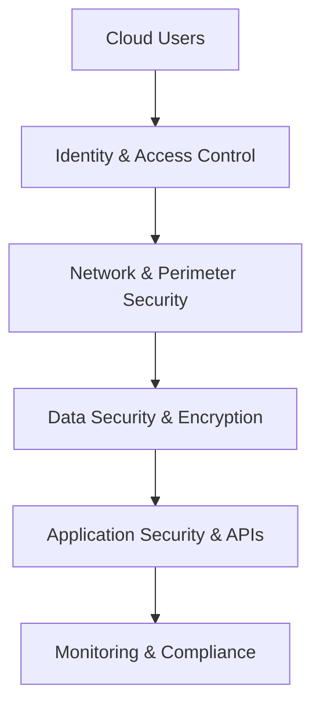
```mermaid
graph TD
    Users[Cloud Users] --> IAM[Identity & Access Control]
    IAM --> Network[Network & Perimeter Security]
    Network --> Data[Data Security & Encryption]
    Data --> App[Application Security & APIs]
    App --> Monitor[Monitoring & Compliance]
```

---

### Q9) Discuss the major security threats in cloud computing as identified by Cloud Security Alliance (CSA).
The CSA identifies major critical threats called the “Top Threats to Cloud Computing”.
1. **Data Breaches**
   - Unauthorized access to sensitive data.
   - Caused by weak IAM, misconfigured storage.
2. **Misconfiguration of Cloud Resources**
   - Wrong S3 bucket permissions, open databases.
   - Most common cloud security issue.
3. **Insecure APIs**
   - APIs exposed without authentication.
   - Allow unauthorized access to cloud resources.
4. **Account Hijacking**
   - Stolen credentials used to access cloud accounts.
   - Caused by phishing, weak passwords.
5. **Insider Threats**
   - Employees or contractors misuse access.
6. **DDoS Attacks**
   - Overwhelming servers to make services unavailable.
7. **Data Loss**
   - Accidental deletion, ransomware, corruption.
8. **Insufficient Logging & Monitoring**
   - Attacks go undetected due to poor visibility.
9. **Shared Technology Vulnerabilities**
   - Hypervisor/VM attacks such as VM escape.
10. **Weak Control Plane Security**
    - Attackers target management consoles (e.g., AWS IAM).

**Conclusion**
These CSA threats highlight the need for strong IAM, encryption, monitoring, and secure configuration in the cloud.

---

### Q10) What is Data Access Control? Explain its need and working in enterprise cloud applications.
**Meaning**
Data Access Control ensures only authorized users, roles, or applications can access specific cloud data.

**Need for Data Access Control**
1. **Protect Sensitive Data**
   - Prevents unauthorized access to personal, financial, or confidential information.
2. **Regulatory Compliance**
   - GDPR, HIPAA, PCI-DSS require strict access control.
3. **Prevents Insider Misuse**
   - Limits privileges of employees and contractors.
4. **Minimizes Security Breaches**
   - Protects data from attackers even if they compromise a user account.

**Working in Enterprise Cloud Applications**
1. **Authentication**
   - Verifies user identity using passwords, biometrics, MFA.
2. **Authorization (RBAC / ABAC)**
   - RBAC: Access based on roles (Admin, Manager, User).
   - ABAC: Access based on attributes (location, time, device).
3. **Policies & Rules**
   - IAM policies define allowed/denied actions on datasets.
4. **Encryption & Key Control**
   - Data encrypted with KMS keys; access granted only to authorized principals.
5. **Audit Logs**
   - Logs monitor access attempts, detect suspicious activity.
6. **Zero-Trust Model**
   - "Never trust, always verify" ensures continuous identity checks.

**Conclusion**
Access control ensures confidentiality and compliance while limiting who can view, modify, or delete cloud data.

---

### Q11) Explain Identity and Access Management (IAM) in cloud computing.
**Definition**
Identity and Access Management (IAM) is a framework of policies, technologies, and controls used to manage user identities and control access to cloud resources.

**Key Components of IAM**
1. **Identity Management**
   - Manages user accounts, credentials, lifecycle (create, update, revoke).
   - Includes passwords, MFA, biometrics.
2. **Authentication**
   - Verifies user identity.
   - Methods: Passwords, OTPs, MFA, OAuth2, SAML.
3. **Authorization**
   - Defines what actions a user can perform.
   - Uses RBAC (Role-Based Access Control) and ABAC (Attribute-Based Access Control).
   - *Example:* Admin vs Developer vs Viewer permissions.
4. **Policy Management**
   - Cloud IAM policies specify allowed/denied actions.
   - *Example:* AWS IAM Policies (JSON-based rules).
5. **Federated Identity**
   - Login using third-party identity providers.
   - *Example:* Google Sign-In, Azure AD, Okta.
6. **Audit & Monitoring**
   - Tracks login attempts, failed authentication, privilege misuse.

**Benefits**
- Prevents unauthorized access
- Enables least-privilege access
- Supports compliance
- Enhances security across cloud services

**Conclusion**
IAM is essential for protecting cloud environments by ensuring the right individuals access the right resources at the right time.

---

### Q12) Compare IaaS, PaaS, and SaaS with suitable examples.
**Definition**
Cloud services are delivered through three primary models: IaaS, PaaS, and SaaS, each offering different levels of control.

1. **Infrastructure as a Service (IaaS)**
   - Provides virtualized hardware: VMs, storage, networks.
   - User controls OS, applications.
   - *Examples:* AWS EC2, Google Compute Engine, Azure VM.
   - *Use Case:* Hosting websites, custom app deployment.
   - *Advantages:* Full control, customizable environment.
2. **Platform as a Service (PaaS)**
   - Provides runtime environment, middleware, databases.
   - Developer deploys code; provider manages infrastructure.
   - *Examples:* Google App Engine, Heroku, Azure App Services.
   - *Use Case:* Web app development/testing.
   - *Advantages:* Faster development, no server management.
3. **Software as a Service (SaaS)**
   - Complete ready-to-use applications delivered over internet.
   - No installation or updates required.
   - *Examples:* Gmail, Salesforce, Zoom, Office 365.
   - *Use Case:* Email, CRM, productivity tools.
   - *Advantages:* Simple to use, zero maintenance.

**Comparison Table**

| Feature | IaaS | PaaS | SaaS |
| :--- | :--- | :--- | :--- |
| **User Controls** | OS & apps | Apps only | Only usage |
| **Maintenance** | High | Medium | None |
| **Target** | IT admins | Developers | End users |

---

### Q13) Explain different Cloud Service Deployment Models: Public, Private, Hybrid, and Community Cloud.
1. **Public Cloud**
   - Services offered to the general public over the internet.
   - Owned & operated by providers like AWS, Azure, GCP.
   - *Advantages:* Low cost, highly scalable, no maintenance.
   - *Example:* Hosting websites on AWS EC2.
2. **Private Cloud**
   - Dedicated cloud environment for a single organization.
   - Hosted on-premises or by third-party vendors.
   - *Advantages:* High security, customization, control.
   - *Example:* OpenStack-based corporate private cloud.
   - *Used by:* Banks, government, defense.
3. **Hybrid Cloud**
   - Combination of public + private cloud.
   - Sensitive data in private cloud; scalable workloads in public cloud.
   - *Advantages:* Flexibility, optimized cost, security.
   - *Example:* Database in private cloud + app servers in AWS.
4. **Community Cloud**
   - Shared by organizations with common interests.
   - *Example:* Hospitals sharing cloud for health data; universities sharing research infrastructure.
   - *Advantages:* Shared cost, common compliance, collaboration.

**Conclusion**
Deployment models differ in cost, security, control, and scalability—organizations choose based on business needs.

---

### Q14) Explain the working of MapReduce framework. Describe the shuffle and sort phases in detail.
**Meaning**
MapReduce is a distributed processing framework used in big data systems for parallel data processing.

**Phases of MapReduce**
1. **Map Phase**
   - Input data split into chunks.
   - Mapper processes each chunk and outputs key-value pairs.
   - *Example:* Word count → (word, 1).
2. **Shuffle Phase (Detailed)**
   - Redistributes intermediate key-value pairs across nodes.
   - All values belonging to the same key are grouped together.
   - Ensures keys processed by correct reducer.
   - Network-intensive phase; sorts and transfers data.
3. **Sort Phase (Detailed)**
   - Occurs alongside shuffle.
   - Each reducer receives sorted keys.
   - Sorting ensures deterministic reduce operations.
   - *Example:* Sorting “apple, banana, apple” → grouped for reducer.
4. **Reduce Phase**
   - Reducer aggregates values for each key.
   - *Example:* (apple → 1,1,1) → 3.
5. **Output Phase**
   - Final results written to HDFS.

**Conclusion**
Shuffle and sort are the core phases ensuring correctness by grouping and organizing intermediate data for reducers.

---

### Q15) Describe the architecture of Hadoop with a neat diagram.
**Definition**
Hadoop is an open-source distributed computing framework consisting of HDFS for storage and MapReduce/YARN for processing.

**Hadoop Architecture Components**
1. **HDFS (Storage Layer)**
   - **NameNode:** Master server storing metadata (file names, block locations).
   - **DataNodes:** Store actual data blocks.
   - Replication provides fault tolerance.
2. **YARN (Processing/Cluster Management Layer)**
   - **ResourceManager:** Allocates resources across nodes.
   - **NodeManager:** Manages containers on each node.
   - **ApplicationMaster:** Manages execution of each distributed application.
3. **MapReduce Layer (Processing Engine)**
   - Executes map → shuffle/sort → reduce tasks in parallel.

**Text Diagram**
```
                +------------------+
                |    Client API    |
                +------------------+
                         ↓
                +------------------+
                |     YARN         |
                | ResourceManager  |
                +------------------+
                         ↓
          +-------------------------------+
          |        MapReduce Engine       |
          +-------------------------------+
                         ↓
     +-----------------------------------------+
     |                 HDFS                    |
     |   NameNode        ←→       DataNodes    |
     +-----------------------------------------+
```

**Conclusion**
Hadoop architecture ensures fault-tolerant storage and scalable parallel processing across distributed nodes.

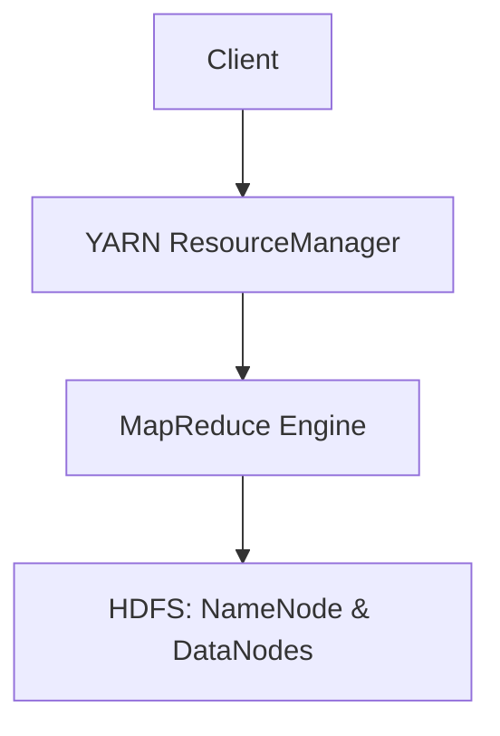
```mermaid
graph TD
    Client --> YARN[YARN ResourceManager]
    YARN --> MR[MapReduce Engine]
    MR --> HDFS[HDFS: NameNode & DataNodes]
```

---

### Q16) What is BigTable? Explain its architecture and significance in distributed storage.
**Definition**
BigTable is Google’s distributed, scalable, NoSQL storage system designed to handle petabytes of structured data across thousands of servers. It powers applications like Google Search Indexing, Google Maps, Gmail, and YouTube.

**Key Features**
- Sparse, distributed, persistent, multi-dimensional sorted map
- Schema-less column families
- High read/write throughput
- Horizontal scalability

**Architecture Components**
1. **Tables, Rows, and Columns**
   - Data stored as (row key, column key, timestamp → value).
   - Rows sorted lexicographically.
2. **Tablet**
   - Tables are divided into tablets.
   - Tablets stored in GFS (Google File System).
   - Allows horizontal scaling.
3. **Tablet Server**
   - Manages read/write requests for tablets.
   - Splits and merges tablets automatically.
4. **Master Server**
   - Assigns tablets to tablet servers.
   - Handles metadata and load balancing.
5. **Chubby Lock Service**
   - Provides distributed locking, leader election.

**Significance**
- Supports massive scalability
- Low latency for large web-scale apps
- Automatic failover and availability
- Ideal for IoT, analytics, social media, search indexing

**Conclusion**
BigTable’s architecture enables Google-scale storage with high availability, consistency, and performance.

---

### Q17) Compare Google File System (GFS) and Hadoop Distributed File System (HDFS).
1. **Purpose**
   - GFS: Internal Google distributed file system for large-scale services.
   - HDFS: Open-source distributed file system inspired by GFS for Hadoop.
2. **Scalability & Architecture**
   - Both use master–slave architecture with a Master (GFS Master / NameNode) and Chunkservers/DataNodes.
3. **File Storage Concepts**
   - GFS: Stores files in fixed-size 64 MB chunks.
   - HDFS: Stores files in blocks (default 128 MB).
4. **Metadata**
   - GFS Master handles namespaces, chunk locations.
   - HDFS NameNode manages metadata; Secondary NameNode assists via checkpointing.
5. **Replication**
   - GFS default replication = 3
   - HDFS default replication = 3 (configurable)
6. **Error Handling**
   - Both use heartbeat and automatic re-replication.
   - HDFS more optimized for batch processing.
7. **Write Model**
   - GFS supports appending writes (record append).
   - HDFS is optimized for write-once-read-many workloads.
8. **Ecosystem Integration**
   - GFS integrated with BigTable, MapReduce.
   - HDFS integrated with Hadoop ecosystem (Hive, Spark, HBase).

**Conclusion**
GFS is proprietary to Google; HDFS is open-source and widely used in big-data applications.

---

### Q18) What is Storage Virtualization? Explain block-level and file-level storage virtualization with examples.
**Definition**
Storage Virtualization abstracts physical storage into a logical, unified storage pool, enabling better performance, flexibility, scalability, and simplified management.

**1. Block-Level Storage Virtualization**
**Meaning**
- Combines multiple physical disks into a unified logical block device.
- Presented to servers as raw block devices.

**How it Works**
- Uses RAID, SAN, or virtual disk aggregators.
- Logical Unit Numbers (LUNs) map to virtualized storage blocks.

**Examples**
- SAN (Storage Area Network), RAID arrays
- VMware VMFS datastores
- IBM SAN Volume Controller
- AWS EBS (behind the scenes uses block virtualization)

**Benefits**
- High performance
- Supports databases and VMs
- Flexible resizing

**2. File-Level Storage Virtualization**
**Meaning**
- Virtualizes file systems across multiple storage devices.
- Users access data as folders/files.

**How it Works**
- Uses NAS, distributed file systems, or cluster storage.

**Examples**
- NFS, SMB
- HDFS
- GlusterFS
- Google File System
- AWS EFS

**Benefits**
- Simple file sharing
- Scalability
- Easy to manage permissions

**Conclusion**
Block-level suits performance-heavy workloads; file-level suits sharing and big-data storage.

---

### Q19) What is Service-Oriented Architecture (SOA)? Explain its role in cloud computing.
**Definition**
SOA is an architectural style where applications are built as a collection of loosely coupled, reusable, interoperable services that communicate over standard protocols.

**Characteristics of SOA**
1. **Loose Coupling**
   - Services independent of each other.
2. **Reusability**
   - Components reused across applications.
3. **Interoperability**
   - Uses standard protocols (SOAP, REST, XML, JSON).
4. **Discoverability**
   - Services registered and discovered dynamically.

**SOA in Cloud Computing**
1. **Foundation for Cloud APIs**
   - Cloud services (AWS, Azure) exposed through REST/SOAP APIs which follow SOA principles.
2. **Supports Multitenancy**
   - Reusable services support multiple clients.
3. **Integration of Heterogeneous Systems**
   - SOA allows cloud systems to communicate with legacy systems (ERP, CRM).
4. **Scalability & Flexibility**
   - SOA-based microservices scale horizontally.
5. **Cost Efficiency**
   - Services reused across cloud applications reduce development effort.

**Examples**
- AWS Lambda functions
- Azure Service Bus
- Google Cloud Functions

**Conclusion**
SOA enables interoperability, flexibility, and modularity, making it ideal for designing scalable cloud-based applications.

---

### Q20) What is Interoperability in cloud environments? How does SOA help in achieving interoperability?
**Interoperability (Definition)**
Interoperability refers to the ability of different cloud systems, services, and applications to work together seamlessly without compatibility issues.

**Why Interoperability Matters**
1. Avoids vendor lock-in
2. Supports hybrid/multi-cloud deployments
3. Allows integration of legacy + cloud systems
4. Simplifies migration and data exchange

**Challenges**
- Different APIs
- Different data formats
- Diverse security policies
- Incompatible platforms

**How SOA Enables Interoperability**
1. **Standard Protocols**
   - SOA uses SOAP, REST, XML, and JSON, enabling uniform communication across platforms.
2. **Loose Coupling**
   - Applications interact without tight dependency, enabling flexible integration.
3. **Service Reusability**
   - Services can be reused across cloud providers.
4. **Well-Defined Interfaces**
   - WSDL, OpenAPI specifications define clear service interfaces.
5. **Middleware Support**
   - ESB (Enterprise Service Bus) enables routing, transformation, and orchestration of cloud services.
6. **API Gateways**
   - Cloud APIs follow SOA patterns, making services callable from any language/system.

**Example**
- A Java app in AWS can call a Python microservice in Azure through REST APIs because SOA ensures standardization.

**Conclusion**
SOA provides the protocols and architectural principles that make interoperability possible in modern multi-cloud environments.

---

## 📘 Quick Revision Sheets & Mind Maps

### ✅ PAGE 1 — CLOUD BASICS (UNIT 1 QUICK REVISION)
**What is Cloud Computing?**
Delivery of IT resources (compute, storage, apps) over the internet on pay-as-use basis.

**NIST Characteristics**
- On-Demand Self Service
- Broad Network Access
- Resource Pooling / Multi-tenancy
- Rapid Elasticity
- Measured Service
- Virtualization-based

**Service Models (SaaS/PaaS/IaaS)**
- SaaS – End-user apps (Gmail, Salesforce)
- PaaS – Developer runtime (Heroku, GAE)
- IaaS – Virtual hardware (EC2, Azure VM)

**Deployment Models**
- Public | Private | Hybrid | Community

**Advantages**
- Cost-saving
- Scalability
- Reliability
- Mobility
- Zero maintenance

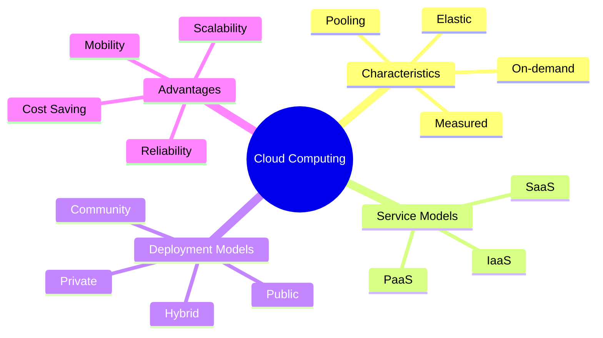
```mermaid
mindmap
  root((Cloud Computing))
    Characteristics
      On-demand
      Elastic
      Measured
      Pooling
    Service Models
      SaaS
      PaaS
      IaaS
    Deployment Models
      Public
      Private
      Hybrid
      Community
    Advantages
      Cost Saving
      Scalability
      Reliability
      Mobility
```

---

### ✅ PAGE 2 — VIRTUALIZATION (UNIT 2 QUICK REVISION)
**What is Virtualization?**
Creating virtual versions of hardware, OS, storage using hypervisors.

**Types**
- Server Virtualization – ESXi, KVM
- OS-Level Virtualization – Docker, LXC
- Storage Virtualization – SAN, RAID
- Network Virtualization – SDN, virtual switches

**Hypervisors**
- Type 1: Bare metal (ESXi, Hyper-V, Xen)
- Type 2: Hosted (VirtualBox, VMware Workstation)

**VM Cloning**
- Full Clone – independent
- Linked Clone – small, fast
Used for fast recovery, deployment, backups.

**Challenges**
- VM escape
- Resource contention
- VM sprawl
- Licensing issues
- Backup complexity

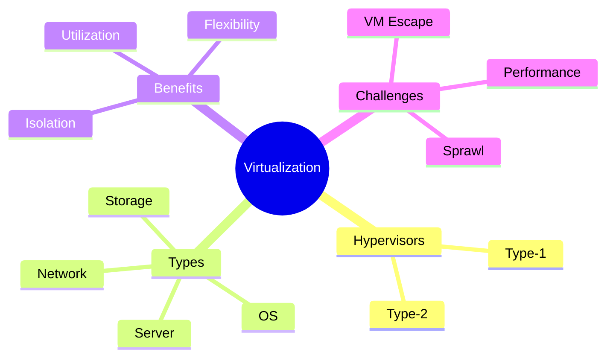
```mermaid
mindmap
  root((Virtualization))
    Hypervisors
      Type-1
      Type-2
    Types
      Server
      OS
      Network
      Storage
    Benefits
      Isolation
      Utilization
      Flexibility
    Challenges
      VM Escape
      Sprawl
      Performance
```

---

### ✅ PAGE 3 — CLOUD MANAGEMENT & MONITORING (UNIT 3)
**Administering Cloud**
- Provision VMs
- Setup networks
- Manage users & IAM
- Configure autoscaling
- Update patches
- Manage logs

**Monitoring Tools**
- AWS CloudWatch
- Azure Monitor
- GCP Operations Suite
Monitors CPU, RAM, network, errors, uptime.

**Load Balancing**
- Round Robin
- Least Connections
- IP Hash
Ensures high availability & equal distribution.

**Resource Optimization**
- Right-sizing VMs
- Deleting unused snapshots
- Using CDNs
- Using autoscaling

**Dynamic Reconfiguration**
- Vertical scaling
- Horizontal scaling
- Hot-plug CPU/RAM

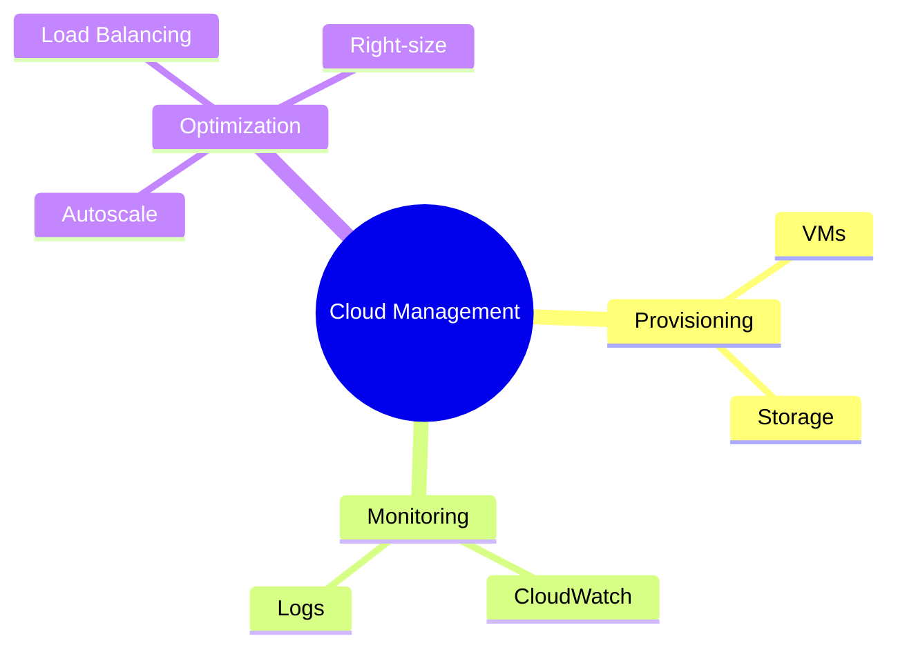
```mermaid
mindmap
  root((Cloud Management))
    Provisioning
      VMs
      Storage
    Monitoring
      CloudWatch
      Logs
    Optimization
      Autoscale
      Load Balancing
      Right-size
```

---

### ✅ PAGE 4 — CLOUD SECURITY (UNIT 4)
**Cloud Security Architecture**
- IAM
- Network Security (WAF, IDS/IPS)
- Data Security (Encryption)
- App Security (API Gateway)
- Monitoring (SIEM, CloudTrail)

**Security Issues**
- Data breach
- Misconfiguration
- Weak APIs
- Denial-of-service
- Insider threats

**CSA Top Threats**
- Data loss
- Account hijacking
- Shared tech vulnerabilities
- Insufficient monitoring
- Misconfigurations

**Access Control**
- RBAC
- ABAC
- Zero-trust model

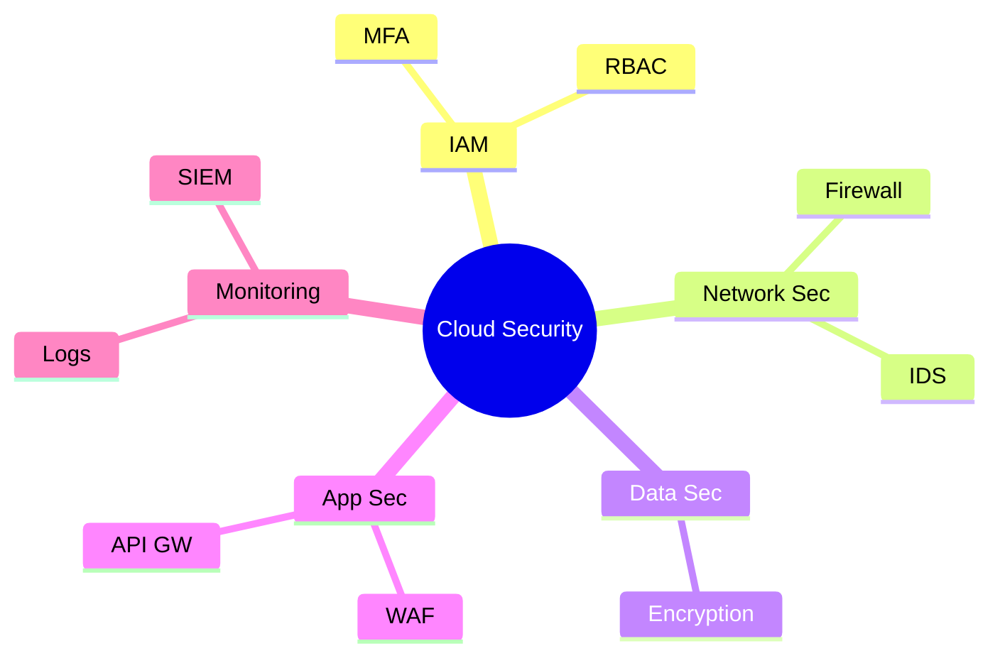
```mermaid
mindmap
  root((Cloud Security))
    IAM
      MFA
      RBAC
    Network Sec
      Firewall
      IDS
    Data Sec
      Encryption
    App Sec
      WAF
      API GW
    Monitoring
      Logs
      SIEM
```

---

### ✅ PAGE 5 — BIG DATA BASICS
**MapReduce**
- Map: Key-value generation
- Shuffle: Group by key
- Sort: Sorted keys
- Reduce: Aggregates values
- Output stored in HDFS.

**Hadoop Architecture**
- HDFS: NameNode + DataNodes
- YARN: ResourceManager, NodeManager
- MapReduce Engine

**BigTable**
- Distributed, sparse, columnar data store
- Stores Google Search Index, Gmail
- Tablets stored in GFS
- Managed by Tablet Servers

**GFS vs HDFS**
- Both master–slave
- GFS proprietary; HDFS open-source
- HDFS suited for batch workloads
- GFS supports record append

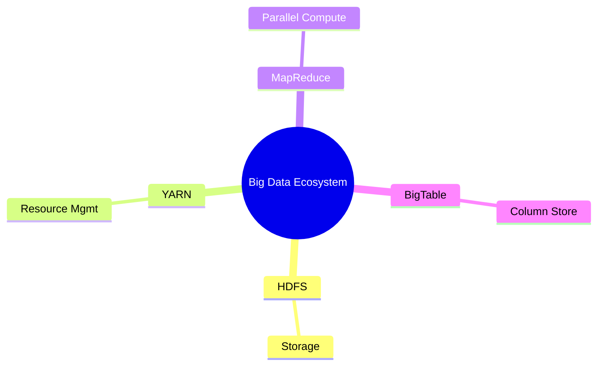
```mermaid
mindmap
  root((Big Data Ecosystem))
    HDFS
      Storage
    YARN
      Resource Mgmt
    MapReduce
      Parallel Compute
    BigTable
      Column Store
```

---

### ✅ PAGE 6 — NETWORK & STORAGE ESSENTIALS
**VLAN**
- Virtual LAN
- Network segmentation
- Enhances security
- Works at Layer 2

**VSAN**
- Virtual Storage Area Network
- Logical segmentation in SAN
- Improves storage isolation

**Storage Virtualization**
- Block-level: SAN, RAID
- File-level: NAS, HDFS, GlusterFS

**Why Virtual Networks?**
- Isolation
- Performance
- Security
- Ease of management

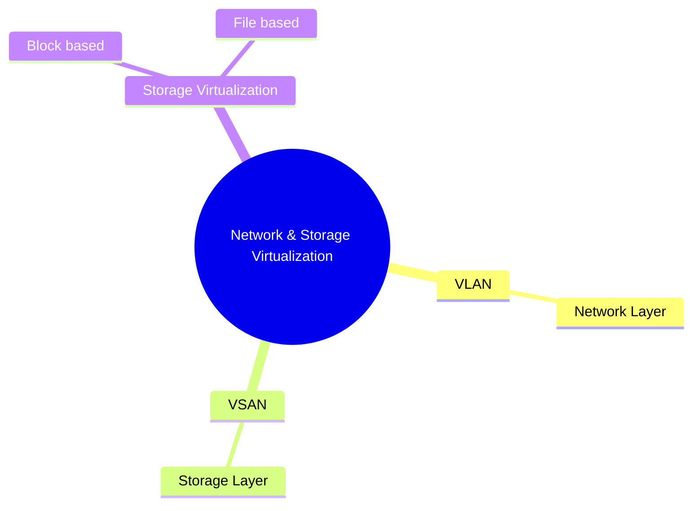
```mermaid
mindmap
  root((Network & Storage Virtualization))
    VLAN
      Network Layer
    VSAN
      Storage Layer
    Storage Virtualization
      Block based
      File based
```

---

### ✅ PAGE 7 — CLOUD MIGRATION
**Seven-step Model**
1. Assess
2. Pilot
3. Identify app profiles
4. Select cloud providers
5. Plan migration steps
6. Execute migration
7. Optimize & monitor

**Migration Challenges**
- Data transfer time
- Security risks
- Downtime
- Legacy app compatibility
- Vendor lock-in
- Compliance issues

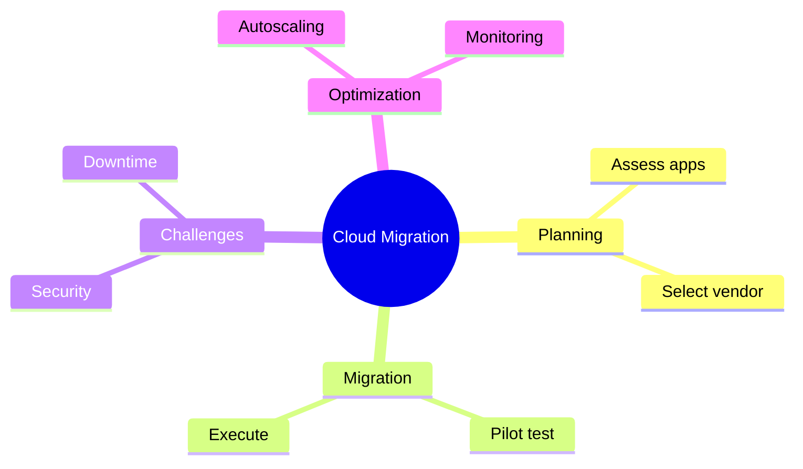
```mermaid
mindmap
  root((Cloud Migration))
    Planning
      Assess apps
      Select vendor
    Migration
      Pilot test
      Execute
    Challenges
      Security
      Downtime
    Optimization
      Autoscaling
      Monitoring
```

---

### ✅ PAGE 8 — SOA & INTEROPERABILITY
**Service-Oriented Architecture (SOA)**
- Loose coupling
- Reusable services
- Standard protocols (REST, SOAP)
- Service registry & discovery

**Role of SOA in Cloud**
- Enables multi-cloud APIs
- Supports interoperability
- Reduces vendor lock-in
- Microservices follow SOA principles

**Interoperability**
- Ability of systems to communicate
- Achieved via:
  - REST, JSON, XML
  - API gateways
  - ESB
  - Identity federation

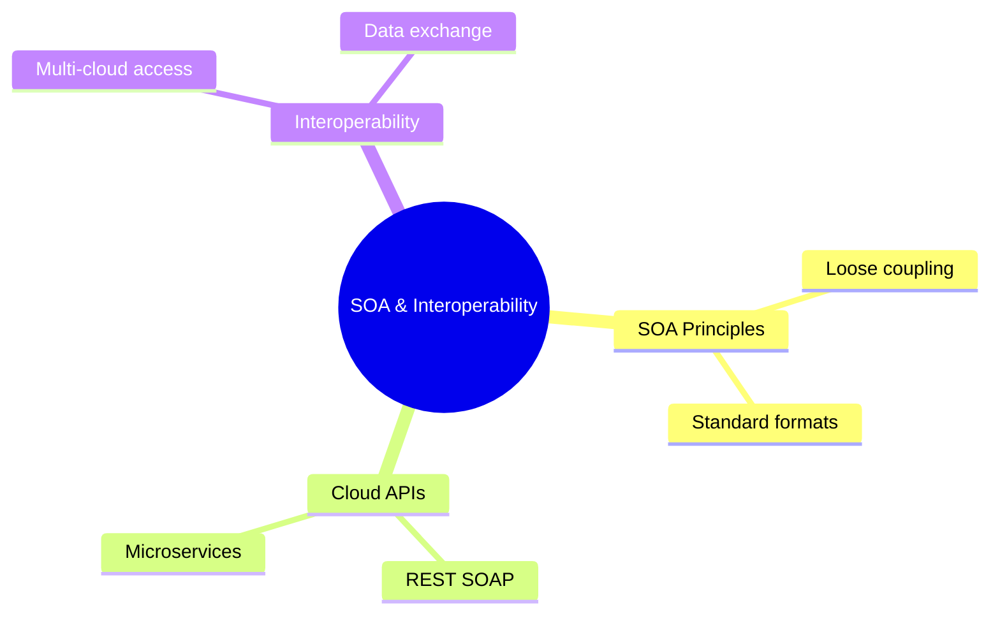
```mermaid
mindmap
  root((SOA & Interoperability))
    SOA Principles
      Loose coupling
      Standard formats
    Cloud APIs
      REST SOAP
      Microservices
    Interoperability
      Multi-cloud access
      Data exchange
```

---

### ✅ PAGE 9 — CLOUD CASE STUDIES
**AWS**
- EC2, S3, RDS, Lambda, VPC
- Scalable, global network
- Pay-as-you-go

**Azure**
- Azure VM, Blob Storage, SQL DB
- Hybrid support
- Strong enterprise integration

**GCP**
- Compute Engine, BigQuery, GKE
- Best for analytics & ML

**OpenStack**
- Nova (compute)
- Swift (object storage)
- Neutron (network)
- Keystone (identity)

**CloudStack / OpenNebula / Eucalyptus**
- Open-source IaaS
- Custom private clouds
- Supports KVM, Xen, VMware

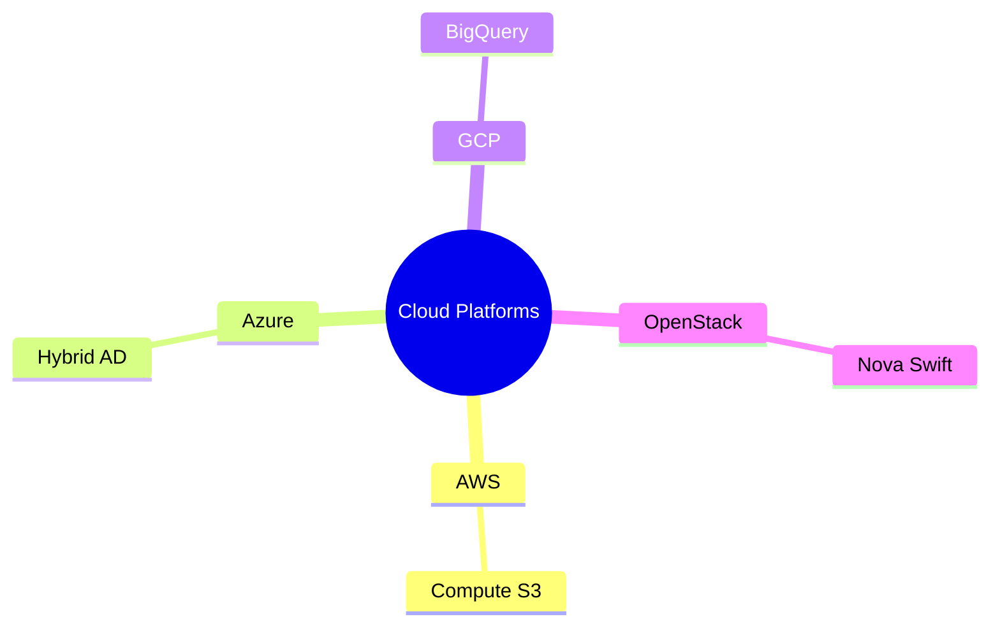
```mermaid
mindmap
  root((Cloud Platforms))
    AWS
      Compute S3
    Azure
      Hybrid AD
    GCP
      BigQuery
    OpenStack
      Nova Swift
```

---

### ✅ PAGE 10 — ULTRA QUICK REVISION SHEET (1 PAGE SUMMARY)
**🔥 Cloud in 10 Points**
- On-demand
- Elastic
- Metered
- Multi-tenant
- Virtualized
- SaaS/PaaS/IaaS
- Public/Private/Hybrid
- IAM for security
- Load balancing + Autoscaling
- HDFS + MapReduce for big data

**🔥 Security in 10 Points**
- IAM
- MFA
- RBAC/ABAC
- Encryption
- WAF
- Firewalls
- SIEM
- CSA Top Threats
- Data Access Control
- Zero-trust model

**🔥 Virtualization in 10 Points**
- Type 1/Type 2
- Docker
- VM Cloning
- Live migration
- Hypervisor attacks
- VM sprawl
- Resource contention
- Storage virtualization
- Network virtualization
- Centralized management

**🔥 Hadoop in 10 Points**
- HDFS
- NameNode
- DataNode
- YARN
- ResourceManager
- MapReduce
- Shuffle
- Sort
- Reduce
- Output
